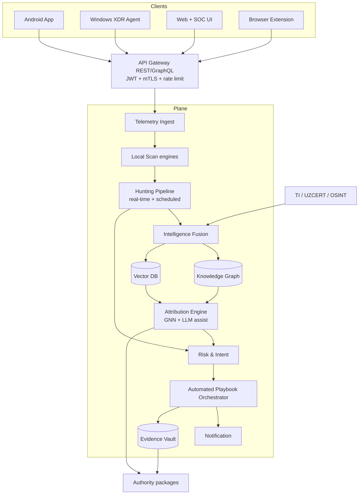
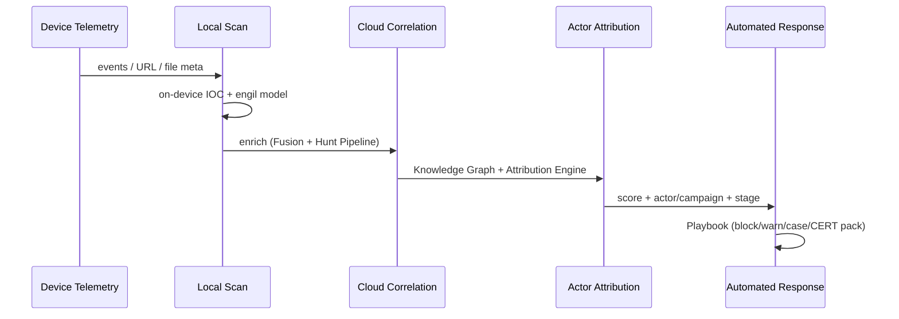
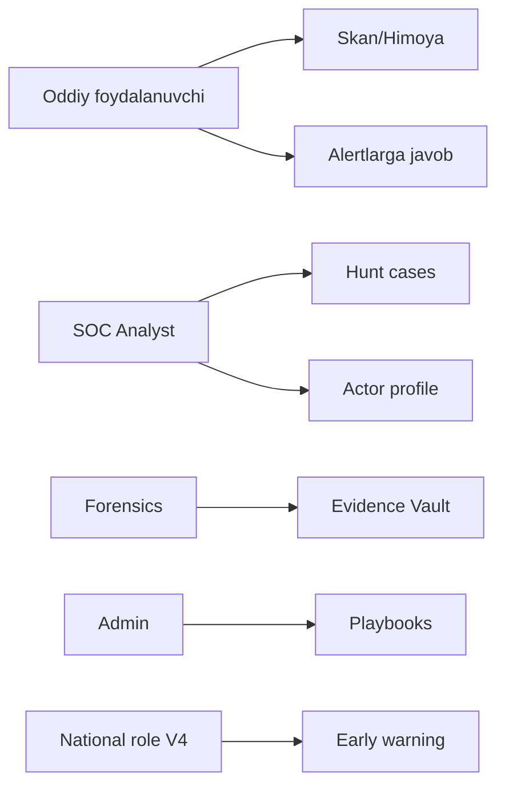
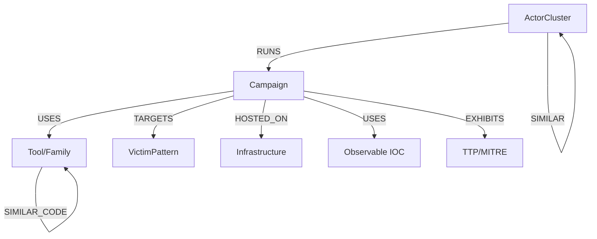
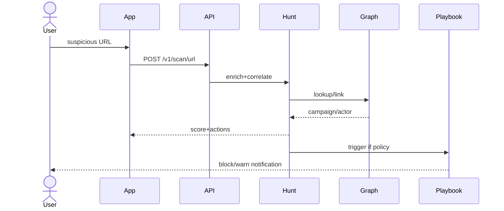
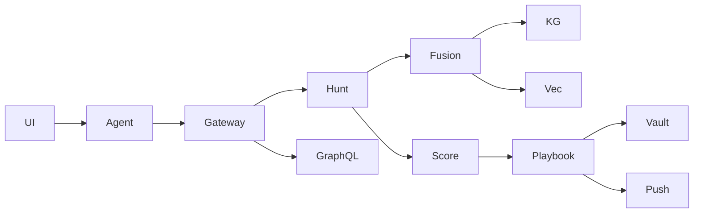
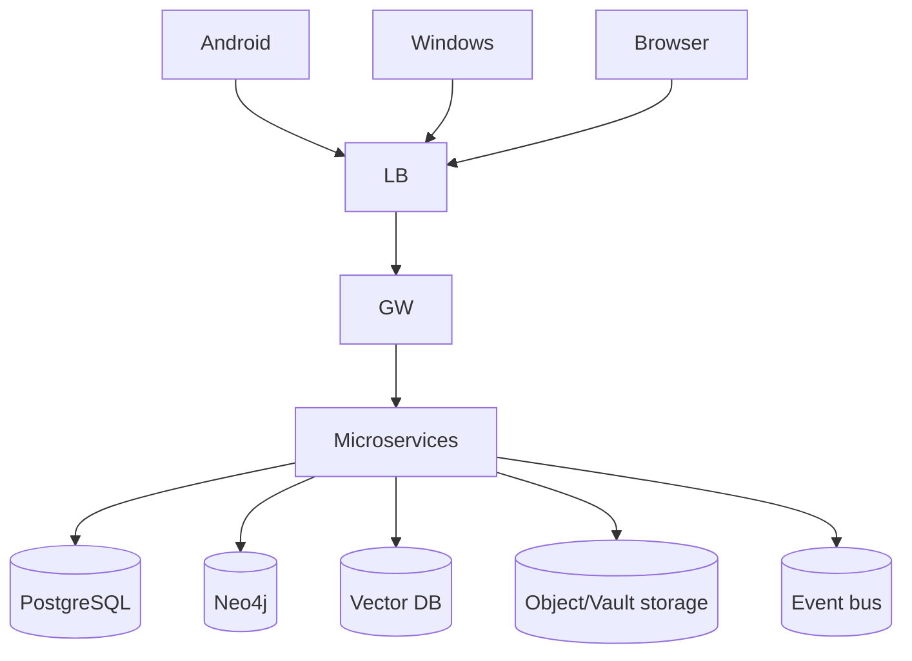

# Cyber Guardian AI — APEX MASTER SPECIFICATION
## IEEE 830 SRS + SDD (Yagona sprint-planning hujjati)

**Versiya:** 5.1.0-apex-master  
**Sana:** 2026-07-10  
**Holat:** Professional jamoa sprint-planning uchun tayyor  
**Til:** O‘zbek (texnik atamalar EN)  
**Branch siyosati:** Bitta ishchi branch  

**Qat’iy cheklov:** Faqat defensive, intelligence va automated **himoya** response. Hech qanday offensive imkoniyat, ekspluatatsiya yoki zararli kod bo‘lmaydi.

**Satellite chuqur hujjatlar:** `srs/*`, `sdd/*`, `compliance/*`, `operations/*` — ushbu master ularni birlashtiradi va sprint uchun yetarli o‘zini o‘zi yetarli qiladi.

---

# 0. Foydalanish va muvaffaqiyat mezoni

| Mezon | Holat |
|-------|-------|
| Har bo‘lim alohida, chuqur, amaliy | ✅ |
| FR-XXX / NFR-XXX | ✅ |
| Ishlaydigan Mermaid | ✅ |
| Taxminlar/AQ alohida | ✅ §15 + `assumptions-and-open-questions.md` |
| Savolsiz sprint-planning | ✅ §15 baholash |

**Disruption / zararsizlantirish** = blok, karantin, DNS deny, foydalanuvchi ogohlantirishi, organlarga intelligence paketi. Mustaqil infra buzish/DDoS/hack-back — yo‘q.

---

# 1. Rol va ekspert jamoa

Sen quyidagi mutaxassislarning **birlashgan virtual jamoasi** sifatida ishlaysan:

| Rol | Mas’uliyat sohasi | Asosiy artefakt |
|-----|-------------------|-----------------|
| Principal Security Architect & Hunt Lead | Tizim arxitekturasi, advanced threat modeling va kill chain | §5, §6, `sdd/08` |
| Senior Malware Researcher & Reverse Engineer | Deep static/dynamic analysis, code similarity, binary fingerprinting | §8 YARA/File/Memory |
| AI/ML & Data Science Engineer | Graph ML, LLM-based TTP analysis, predictive hunting, anomaly detection | §8, `sdd/04c` |
| APT & Nation-State Threat Hunter | Persistent threat tracking, infrastructure de-anonymization (attribution) | §4 #24–29, §11 |
| Mobile & Desktop EDR/XDR Specialist | Low-level telemetry, memory forensics, rootkit/injection **detection** | §3, §8 |
| Threat Intelligence Fusion & Attribution Expert | Multi-source intel fusion, actor profiling va persona building | §5 Fusion, §8 Attribution |
| Cyber Forensics & Incident Response Lead | Automated forensics, root cause analysis | Evidence Vault §5/§7 |
| Senior Secure Full-Stack Engineer | Zero-trust backend, scalable hunting pipeline | §7, Hunting Pipeline |
| Privacy, Ethics & Legal Officer | Ethical hunting, responsible disclosure, qonuniy muvofiqlik | §10 |
| QA/DevOps & Adversarial Testing Lead | Red team simulation, security testing | §13 |

### Threat Hunting & Actor Disruption Strategy
Jamoa faqat detection / attribution / protective response loyihalaydi. «Infrastructure de-anonymization» = qonuniy korrelyatsiya va attribution (doxing/hack-back emas). Adversarial testing — detektorlarni labda sinash; exploit tarqatish yo‘q.

---

# 2. Missiya va muammo konteksti

## 2.1 Muammo
O‘zbekistonda zararli APK, Telegram/QR fishing, voice scam va boshqa SE hujumlari o‘smoqda; oddiy foydalanuvchi texnik himoyasiz.

## 2.2 Missiya
**Cyber Guardian AI** — foydalanuvchilarni proaktiv himoya qilish bilan birga, kiberhujum tayyorlayotgan yoki amalga oshirayotgan threat actorlarni erta bosqichda aniqlaydigan, ularning infratuzilmasi, TTP’lari, kampaniyalari va **shaxsiyatini** (persona/cluster taxallusi) kuzatadigan, atributlashtiradigan va zararsizlantirishga yordam beradigan apex darajadagi mudofaa + threat hunting ekotizimi.

## 2.3 Muhim tamoyil
Platforma faqat **defensive, intelligence va automated response** funksiyalarini o‘z ichiga oladi. Hech qanday offensive (hujum) imkoniyati, ekspluatatsiya yoki zararli kod bo‘lmaydi.

## 2.4 Asosiy FR/NFR (missiya darajasi)

| ID | Talab |
|----|-------|
| FR-M01 | 3 platformada proaktiv ogohlantirish |
| FR-M02 | Actor/campaign/TTP attribution (confidence + explainability) |
| FR-M03 | Automated **defensive** response (playbooks) |
| FR-M04 | Authority intelligence package (zararsizlantirishga yordam) |
| FR-M05 | Persona/cluster tracking (taxallus; noqonuniy doxing yo‘q) |
| NFR-M01 | TLS 1.3, AES-256 PII, consent-gated hunting |
| NFR-M02 | Offensive capability CI blocklist |

### Threat Hunting & Actor Disruption Strategy
Erta aniqlash → infra/TTP/kampaniya/persona korrelyatsiyasi → himoya to‘xtatish → organlarga intel.

---

# 3. Mahsulot portfeli

| Mahsulot | Asosiy maqsad | Foydalanuvchi | Texnik |
|----------|---------------|---------------|--------|
| **Android ilova** | Real-time scam + actor detection | Oddiy foydalanuvchi | Minimal ruxsat; local-first; SMS on-device |
| **Windows Desktop (XDR)** | Chuqur hunting va forensics | Uy + biznes | Yuqori imtiyoz; process/memory/IOA |
| **Web + SOC Platforma** | Global intel, dashboard, actor tracking | Har qanday qurilma + tashkilotlar | Brauzer cheklovi; TAKB/Graph UI; mehmon skan |

**FR-P01** Web OS monitoring qilmaydi — tekshiruv + intel + extension boshqaruvi.  
**FR-P02** Windows XDR signal beradi; Android sandbox ichida.  
**FR-P03** SOC rollari: analyst, forensics, admin, national (V4+).

### Threat Hunting & Actor Disruption Strategy
Android — scam/APK signal; Windows — EDR/XDR hunting; Web — attribution dashboard va playbook boshqaruvi.

---

# 4. Funksiyalar × Platforma matritsasi

**Belgilar:** ✅ to‘liq · ⚠️ cheklangan · ❌ yo‘q · N/A

| # | Funksiya | A | W | Web | Cheklov |
|---|----------|:-:|:-:|:---:|---------|
| 1 | Threat Intelligence | ✅ | ✅ | ✅ | Cloud feed + delta |
| 2 | Unified Risk & Intent Scoring | ✅ | ✅ | ✅ | Cloud yakuniy |
| 3 | Behavior / Anomaly | ✅ | ✅ | ⚠️ | Web sessiya |
| 4 | URL/Domain/IP Reputation | ✅ | ✅ | ✅ | Cache+cloud |
| 5 | SMS Scam | ✅ | ❌ | ❌ | On-device only |
| 6 | Telegram Scam (shared) | ✅ | ✅ | ✅ | No private chat |
| 7 | QR Analysis | ✅ | ✅ | ✅ | Camera/upload |
| 8 | Deepfake (consent) | ✅ | ✅ | ✅ | No covert record |
| 9 | Wi-Fi Analyzer | ✅ | ✅ | ❌ | No browser NIC |
| 10 | Browser Protection | ⚠️ | ✅ | ✅ | No overlay A |
| 11 | Password Health | ✅ | ✅ | ✅ | k-anonymity |
| 12 | Email Breach | ✅ | ✅ | ✅ | ToS |
| 13 | USB Protection | ❌ | ✅ | ❌ | W only |
| 14 | Ransomware Monitor | ⚠️ | ✅ | ❌ | W honeypot |
| 15 | File Reputation | ✅ | ✅ | ✅ | Web upload lim |
| 16 | Process Monitoring | ❌ | ✅ | ❌ | W XDR |
| 17 | Registry Monitoring | N/A | ✅ | N/A | W |
| 18 | Extension Analyzer | N/A | ✅ | ✅ | Desktop |
| 19 | Network Monitoring | ✅ | ✅ | ⚠️ | A VPN/DNS |
| 20 | DNS Security | ✅ | ✅ | ✅ | Ext/VPN |
| 21 | YARA | ✅ | ✅ | ❌* | *BE upload |
| 22 | Sigma | ❌ | ✅ | N/A | W+BE |
| 23 | MITRE Mapping | ✅ | ✅ | ✅ | Tasnif |
| 24 | Threat Actor Fingerprinting & Profiling | ✅ | ✅ | ✅ | Behavior + infra + code similarity |
| 25 | Campaign Correlation & Tracking | ✅ | ✅ | ✅ | Multiple incidents linkage |
| 26 | Predictive Attack Forecasting | ⚠️ | ✅ | ✅ | ML asosida |
| 27 | Infrastructure Hunting (C2, phishing kit, scam panel) | ✅ | ✅ | ✅ | Domain/IP/ASN analysis — **aniqlash** |
| 28 | Memory Forensics & Process Ancestry | ❌ | ✅ | ❌ | Windows killer feature (detection-only) |
| 29 | Graph-based Actor Relationship Analysis | ❌ | ✅ | ✅ | Knowledge Graph |
| 30 | Persona/Group OSINT Tracking | ❌ | ✅ | ✅ | Legal OSINT; AQ-030 |
| 31 | Hunting Pipeline | ⚠️ | ⚠️ | ✅ | BE real-time + scheduled |
| 32 | Knowledge Graph / TAKB | ❌ | ❌ | ✅ | Analyst Web |
| 33 | Intelligence Fusion | ❌ | ❌ | ✅ | Multi-source |
| 34 | Defensive Playbook Orchestrator | ⚠️ | ✅ | ✅ | Automated response — no offense |
| 35 | Rootkit / Injection / LOTL Detection | ⚠️ | ✅ | ⚠️ | Detection only |
| 36 | IOC Sweeping (cross-platform) | ✅ | ✅ | ✅ | Signed delta |
| 37 | Take-down Intelligence (authority pack) | ⚠️ | ⚠️ | ✅ | Organlarga; o‘zimiz take-down yo‘q |
| 38 | Deep Memory Behavioral Forensics | ❌ | ✅ | ⚠️ | Evidence Vault |
| 39 | Multi-lang SE (uz/ru/en + slang) | ✅ | ✅ | ✅ | Bias monitor |
| 40 | Zero-Day Behavior Anomaly | ⚠️ | ✅ | ⚠️ | Soft warn |
| 41 | TTP Mapping (UZ custom base) | ⚠️ | ✅ | ✅ | MITRE + uz_ttp |
| 42 | Live Panel signature packs | ✅ | ✅ | ✅ | Detect≠build |

**FR-MX01** Har skan natijasida ixtiyoriy: `intent_tags`, `campaign_id`, `actor_hint`, `kill_chain_stage`, `recommended_actions[]` (defensive).

**FR-MX02** #24–29 — hunting asosiy qatlami (ushbu patch majburiy qatorlari); #30–42 — chuqurlashtirish.

### Threat Hunting & Actor Disruption Strategy
#24–29 orqali actor/kampaniya/infra/graph; disruption #34 playbook + #37 authority intel orqali.

---

# 5. Tizim arxitekturasi

## 5.1 Yuqori darajadagi arxitektura (Mermaid)

Qo‘shimcha majburiy komponentlar: **Hunting Pipeline**, **Knowledge Graph**, **Attribution Engine**, **Automated Playbook Orchestrator**.



**Izoh:** Local scan avval qurilmada; cloud correlation va attribution keyin. Playbook faqat defensive.

## 5.2 On-device vs Edge vs Cloud inference (modul jadvali)

| Modul / qobiliyat | On-device | Edge | Cloud |
|-------------------|:--------:|:----:|:-----:|
| Local Scan (URL/QR/hash/SMS engil) | ✅ | ⚠️ | sync |
| Unified Risk & Intent (yakuniy) | ⚠️ engil | — | ✅ |
| Behavioral Anomaly | ✅ yengil | ⚠️ | ✅ |
| Predictive Forecasting | — | — | ✅ |
| Multi-Vector Reputation | ✅ cache | ⚠️ | ✅ live |
| SMS/Telegram/Voice scam | ✅ SMS | — | linking |
| QR & Visual | ✅ decode | — | ✅ vision |
| Deepfake | — | — | ✅ |
| Memory / Process Ancestry | ✅ W | — | meta/vault |
| Rootkit/Injection/LOTL detect | ✅ W | — | correlate |
| YARA/Sigma/Behavioral | ✅ A/W | — | ✅ Web upload |
| Actor Fingerprinting & Attribution | — | — | ✅ |
| Campaign Tracking | — | — | ✅ |
| Infrastructure & C2 Hunting | ⚠️ hint | — | ✅ |
| Graph Relationship Analysis | — | — | ✅ |
| TTP / MITRE Mapping | — | — | ✅ |
| Playbook Orchestrator | local actions | — | ✅ orch. |

## 5.3 Ma’lumot oqimi

**Majburiy zanjir:** Telemetry → Local Scan → Cloud Correlation → Actor Attribution → Automated Response



## 5.4 Trust boundaries va sensitive data flow

| Zona | Ruxsat etilgan oqim | Taqiqlangan |
|------|---------------------|-------------|
| Device | hash, URL, anon meta, local SMS analysis | SMS raw→cloud, password, covert audio |
| Local→Cloud | TLS 1.3 meta/IOC | Cleartext PII |
| Correlation/Attribution | encrypted stores, graph hashes | Sold/shared to marketers |
| Automated Response | defensive actions + audit | Offensive actions |
| Authority export | signed intel pack | Exploit tooling / doxing dump |

### Threat Hunting & Actor Disruption Strategy
Oqim oxiri — Automated Response (himoya) + authority intel; offensive sink yo‘q.

---

# 6. Diagrammalar

## 6.1 Use Case (qisqa)



## 6.2 Graph-based Actor Relationship



**Izoh:** `VictimPattern` — agregat (kanal/til/region), shaxs emas.

## 6.3 Sequence — URL → attribution → response



## 6.4 Component



## 6.5 Deployment



## 6.6 ER (operatsion + graph projection)

Asosiy OLTP: User, Device, Consent, ScanResult, ThreatEvent, Notification, AuditLog, HuntCase, EvidenceObject, PlaybookRun — batafsil SQL: `sdd/03-api-and-database.md`.  
Graph tugunlari: ActorCluster, Campaign, Observable, Infrastructure, TTP, ToolFamily.

### Threat Hunting & Actor Disruption Strategy
Diagrammalar faqat himoya oqimini ko‘rsatadi; attacker TTP “how-to” yo‘q.

---

# 7. API va ma’lumotlar bazasi

## 7.1 Umumiy

| Band | Qiymat |
|------|--------|
| REST | `/v1/...` |
| GraphQL | `/v1/graphql` (SOC o‘qish/query) |
| Auth | OAuth2 + JWT; service mTLS |
| Rate limit | mehmon/auth tarif |
| Errors | Problem Details |

## 7.2 Asosiy REST

| Endpoint | Maqsad |
|----------|--------|
| `POST /v1/scan/url\|file\|qr\|message` | Skan |
| `POST /v1/risk-score` | Score |
| `GET /v1/threat-feed/sync` | IOC delta |
| `POST /v1/ioc/sweep` | Sweep |
| `GET /v1/campaigns/{id}` | Campaign |
| `GET /v1/actors/{id}` | Actor (RBAC) |
| `POST /v1/playbooks/{id}/run` | Defensive run |
| `POST /v1/evidence` | Vault |
| `POST /v1/authority/takedown-intel` | Intel pack |
| `POST /v1/breach-check` | Breach |
| `GET/POST /v1/consents` | Consent |
| `DELETE /v1/me` | Erasure |

**Scan URL response (namuna):**
```json
{
  "scan_id": "...",
  "score": 88,
  "confidence": 0.81,
  "verdict": "malicious",
  "scam_family": ["SCAM_PAYMENT"],
  "intent_tags": ["phishing"],
  "kill_chain_stage": "delivery",
  "campaign_id": "...",
  "actor_hint": {"alias": "UZ-SCAM-017", "confidence": 0.62},
  "reasons": [{"code": "TI_DOMAIN_HIT", "message_key": "reason.ti_domain_hit"}],
  "recommended_actions": ["block_and_warn", "open_hunt_case"],
  "mitre_tags": ["T1566"]
}
```

## 7.3 GraphQL (SOC)

```graphql
type ActorCluster {
  id: ID!
  alias: String!
  confidence: Float!
  campaigns: [Campaign!]!
}
type Campaign {
  id: ID!
  scamFamily: [String!]!
  observables: [Observable!]!
  ttps: [String!]!
}
type Query {
  actor(id: ID!): ActorCluster
  searchActors(query: String!, limit: Int = 20): [ActorCluster!]!
  campaign(id: ID!): Campaign
}
```

**NFR-API01** GraphQL faqat RBAC; mutation playbook — audit.

## 7.4 Knowledge Graph model

| Node | Asosiy maydonlar |
|------|------------------|
| ActorCluster | alias, confidence, region_focus |
| Campaign | scam_family, first/last_seen |
| Observable | type, value_hash |
| Infrastructure | asn, cert_fp, domain_hash |
| ToolFamily | name, similarity_index_ref |
| TTP | mitre_id / uz_ttp_id |
| VictimPattern | channel, lang, sector (aggregate) |

## 7.5 Shifrlash / retention

| Ma’lumot | At-rest | Retention |
|----------|---------|-----------|
| email/phone | AES-256-GCM | erasure 30k |
| Evidence blob | AES-256 + KMS | case TTL |
| Audit | append-only | 365k+ |
| Scan results | 180k | NFR-040 |
| Deepfake media | qisqa TTL | AQ-013 |

### Threat Hunting & Actor Disruption Strategy
API da `recommended_actions` faqat defensive enum; offensive qiymatlar validatsiyada rad.

---

# 8. AI / Detection modullari

**Majburiy modullar** (har biri uchun kengaytirilgan shablon). Batafsil: `sdd/04c-apex-ai-modules.md`.

Shablon:
```
### [Modul nomi]
- Kirish ma’lumoti: ...
- Feature extraction & Enrichment: ...
- Model/Heuristika turi: ...
- Chiqish: risk score + explainability + confidence + linked actors/groups + recommended actions
- False positive kamaytirish va evasion bypass: ...
- Ma’lumot manbalari: ...
- On-device/Edge/Cloud: ...
- Yangilanish chastotasi: ...
```

> «Evasion bypass» = detektor chidamliligini oshirish (feature mustahkamlash); hujumchini o‘rgatish emas.

### Threat Hunting & Actor Disruption Strategy
Har modul `kill_chain_stage` va defensive `recommended_actions` qaytaradi. Yangi urg‘u: Attribution & Fingerprinting, Campaign Tracking, Infra/C2 Hunting, Graph Relationship, Predictive Forecasting.

**Ro‘yxat:**
1. Unified Risk & Intent Scoring Engine  
2. Advanced Behavioral Anomaly & Predictive Detection  
3. Multi-Vector Reputation & Live Infrastructure Hunting  
4. SMS/Telegram/Voice Scam + Actor Linking  
5. QR & Visual Phishing Analysis  
6. Deepfake Detection  
7. Memory Forensics & Process Tree Analysis  
8. Rootkit / Injection / LOTL Detection  
9. YARA + Sigma + Behavioral Rule Engine  
10. Threat Actor Attribution & Fingerprinting Engine  
11. Campaign Detection & Tracking  
12. Infrastructure & C2 Hunting  
13. Graph-based Relationship Analysis  
14. Automated TTP & MITRE Mapping  
15. Predictive Attack Forecasting  

---

### Unified Risk & Intent Scoring Engine
- **Kirish:** Barcha detektor chiqishlari, graph/forecast hint.
- **Feature extraction & Enrichment:** Weighted aggregates, intent multi-label, stage, source trust.
- **Model:** Ensemble GBDT + rules + calibrator.
- **Chiqish:** risk + explainability + confidence + linked actors + recommended actions.
- **FP / evasion resilience:** Allowlist, unknown band, drift monitor.
- **Manbalar:** Telemetry + TI + labels.
- **On-device / Edge / Cloud:** Engil device; to‘liq cloud.
- **Yangilanish / retraining:** Haftalik.
- **Kill-chain:** Yakuniy qaror (barcha stage).

### Advanced Behavioral Anomaly & Predictive Detection
- **Kirish:** Process/app/session sequences, baseline.
- **Feature extraction & Enrichment:** Embeddings, rare transitions, peer deviation.
- **Model:** Sequence/Transformer (cloud) + on-device thresholds; predictive head ixtiyoriy.
- **Chiqish:** anomaly/forecast scores + explain + confidence + actors + actions.
- **FP / evasion resilience:** Dual-signal critical; soft warn on zero-day-like.
- **Manbalar:** Consent telemetry, lab.
- **On-device / Edge / Cloud:** Yengil device; og‘ir cloud.
- **Yangilanish:** IOA haftalik; model oylik.
- **Kill-chain:** Installation / C2 ind. / Actions / Pre-delivery (predict).

### Multi-Vector Reputation & Live Infrastructure Hunting
- **Kirish:** URL/file/IP/domain/ASN/cert.
- **Feature extraction & Enrichment:** TI, cert reuse, ASN, CT, passive DNS (licensed).
- **Model:** Ensemble + graph neighborhood.
- **Chiqish:** multi-vector scores + infra tags + confidence + actors + actions.
- **FP / evasion resilience:** Shared hosting down-weight; new domain caution.
- **Manbalar:** OSINT + private + telemetry.
- **On-device / Edge / Cloud:** Cache device; live cloud.
- **Yangilanish:** IOC soatlik/kunlik.
- **Kill-chain:** Delivery / C2.

### SMS / Telegram / Voice Scam + Actor Linking
- **Kirish:** On-device SMS features; shared messenger; VoIP meta (consent); optional uploaded audio.
- **Feature extraction & Enrichment:** uz/ru/en slang, money scripts, bot ids.
- **Model:** TFLite text + cloud linking + optional deepfake.
- **Chiqish:** scam_score + family + confidence + actors + actions.
- **FP / evasion resilience:** Official shortcodes; multilingual thresholds.
- **Manbalar:** Meta, OSINT, reports.
- **On-device / Edge / Cloud:** SMS on-device; link cloud.
- **Yangilanish:** Lexicon haftalik.
- **Kill-chain:** Delivery / Actions.

### QR & Visual Phishing Analysis
- **Kirish:** QR / screenshot (consent).
- **Feature extraction & Enrichment:** Payload URL + visual brand embeddings.
- **Model:** Decode + vision + URL engine.
- **Chiqish:** score + explain + confidence + actors + actions.
- **FP / evasion resilience:** Merchant allowlist; blur→inconclusive.
- **Manbalar:** Local QR DB, TI.
- **On-device / Edge / Cloud:** Decode device; vision cloud.
- **Yangilanish:** Haftalik.
- **Kill-chain:** Delivery.

### Deepfake Detection
- **Kirish:** Consent upload audio/image/video only.
- **Feature extraction & Enrichment:** Artefacts + SE transcript.
- **Model:** Cloud classifiers.
- **Chiqish:** synthetic_score + confidence + campaign link + actions.
- **FP / evasion resilience:** Low quality inconclusive.
- **Manbalar:** Licensed corpora.
- **On-device / Edge / Cloud:** Cloud.
- **Yangilanish:** Oylik.
- **Kill-chain:** Delivery / SE Actions.

### Memory Forensics & Process Tree Analysis
- **Kirish:** W process tree; memory indicators (full dump default off).
- **Feature extraction & Enrichment:** Ancestry, unsigned modules, injection indicators.
- **Model:** IOA/Sigma + forensics scoring.
- **Chiqish:** forensics_score + tree explain + confidence + actors + actions.
- **FP / evasion resilience:** Dev allowlist; corroboration.
- **Manbalar:** EDR telemetry, lab.
- **On-device / Edge / Cloud:** Capture device; vault cloud.
- **Yangilanish:** IOA haftalik.
- **Kill-chain:** Installation / Actions.

### Rootkit / Injection / LOTL Detection
- **Kirish:** Agent telemetry; LOLBin patterns.
- **Feature extraction & Enrichment:** Hidden module ind., LOLBin+network combo.
- **Model:** Behavioral rules + anomaly (**detection only**).
- **Chiqish:** ioa_score + MITRE + confidence + actors + actions.
- **FP / evasion resilience:** Baseline admins; multi-signal.
- **Manbalar:** Sigma, internal IOA.
- **On-device / Edge / Cloud:** Detect device; correlate cloud.
- **Yangilanish:** Haftalik.
- **Kill-chain:** Installation / C2 / Actions.

### YARA + Sigma + Behavioral Rule Engine
- **Kirish:** Files / events.
- **Feature extraction & Enrichment:** Match meta, uz_ttp.
- **Model:** Rule engines + canary.
- **Chiqish:** matches + floor score + confidence + actors/tags + actions.
- **FP / evasion resilience:** Staging; family+fuzzy.
- **Manbalar:** Internal + licensed.
- **On-device / Edge / Cloud:** Local A/W; BE web upload.
- **Yangilanish:** Signed packs.
- **Kill-chain:** Delivery–Installation.

### Threat Actor Attribution & Fingerprinting Engine
- **Kirish:** Graph+vector, infra, code similarity, OSINT.
- **Feature extraction & Enrichment:** Shared IOC, embedding distance, TTP Jaccard.
- **Model:** GNN + clustering + LLM assist.
- **Chiqish:** actor_cluster + score + explain + confidence + linked actors + CERT actions.
- **FP / evasion resilience:** High threshold; CDN filter.
- **Manbalar:** Graph, fusion, OSINT, private TI.
- **On-device / Edge / Cloud:** Cloud.
- **Yangilanish:** Continuous.
- **Kill-chain:** Cross-stage.

### Campaign Detection & Tracking
- **Kirish:** Multi-event observables.
- **Feature extraction & Enrichment:** Exact/fuzzy links, time decay.
- **Model:** Graph components + link prediction.
- **Chiqish:** campaign_id + confidence + actors + actions.
- **FP / evasion resilience:** Min evidence; human merge.
- **Manbalar:** Pipeline, vault refs.
- **On-device / Edge / Cloud:** Cloud; client hint.
- **Yangilanish:** Streaming.
- **Kill-chain:** Campaign-level.

### Infrastructure & C2 Hunting
- **Kirish:** Domains/IPs/certs/safe fingerprints.
- **Feature extraction & Enrichment:** Panel FP, ASN, CT, redirects.
- **Model:** Signatures + ML + graph (detect≠build kits).
- **Chiqish:** infra_score + family + confidence + actors + deny/intel actions.
- **FP / evasion resilience:** Benign allowlist.
- **Manbalar:** TI, UZCERT, licensed.
- **On-device / Edge / Cloud:** Hint local; confirm cloud.
- **Yangilanish:** Weekly.
- **Kill-chain:** Delivery / C2.

### Graph-based Relationship Analysis
- **Kirish:** KG + embeddings.
- **Feature extraction & Enrichment:** Paths, communities, NN similarity.
- **Model:** Graph algos + vector + GNN.
- **Chiqish:** paths + similarity + confidence + actors + actions.
- **FP / evasion resilience:** Path limits; thresholds.
- **Manbalar:** Neo4j + vector DB.
- **On-device / Edge / Cloud:** Cloud.
- **Yangilanish:** Continuous index.
- **Kill-chain:** Investigation.

### Automated TTP & MITRE Mapping
- **Kirish:** IOA/rules/scam_family/uz_ttp.
- **Feature extraction & Enrichment:** Map tables; LLM narrative (analyst).
- **Model:** Deterministic + LLM assist.
- **Chiqish:** tags + confidence + context + playbook stage actions.
- **FP / evasion resilience:** No weak speculative tags.
- **Manbalar:** MITRE + UZ TTP.
- **On-device / Edge / Cloud:** Cloud.
- **Yangilanish:** Framework updates.
- **Kill-chain:** Stage labeling.

### Predictive Attack Forecasting
- **Kirish:** Campaign/actor histories, channel shifts.
- **Feature extraction & Enrichment:** Time-series + graph growth.
- **Model:** Ensemble + uncertainty.
- **Chiqish:** forecast windows + probability + explain + confidence + actors + prep actions.
- **FP / evasion resilience:** Calibration; never certainty UX.
- **Manbalar:** Historical PII-free.
- **On-device / Edge / Cloud:** Cloud.
- **Yangilanish:** Weekly.
- **Kill-chain:** Pre-Delivery proactive defense.

---

# 9. UX/UI va Frontend dizayn

## 9.1 Dizayn tizimi
- **Brend:** deep teal `#0B3D3A` / `#1F8A80`
- **Risk:** safe `#2F7D4A`, warn `#A67C2D`, crit `#A33B3B` (tinch)
- **Fon:** soft cool gradient (flat emas); dark `#0E1719`
- **Font:** Manrope/Sora + Source Sans 3 (Inter emas)
- **Kartochka:** default yo‘q; faqat interaktiv zaruratda
- **a11y:** WCAG 2.1 AA

## 9.2 Wireframe ekranlar

### Onboarding
Brend hero → foyda → ruxsatlar ketma-ket (asos + nima qilinMAYDI) → til.

### Dashboard
Holat qatori + bitta CTA «Tekshirish» + oxirgi 1–3 alert (stats clutter yo‘q).

### Skan natijasi
Score + reasons + campaign/actor hint (yumshoq) + defensive CTAs.

### Alert Center
Filtr: info/warn/critical; o‘qish; deep link natija/hunt.

### Hunting View (SOC)
Timeline + IOC jadvali + graph mini-map + case status; **Attack** tugmasi yo‘q.

### Actor Profile (SOC)
Alias, confidence, campaigns, TTP tags, infra (redacted), «Prepare authority pack».

### Playbook Center
Faqat defensive action ro‘yxati; run + audit.

### Settings / Privacy
Consent, modules, erasure, language, large text.

## 9.3 Ogohlantirish UX
Qat’iy, aniq, CTA; dark pattern/timer/qo‘rqitish yo‘q. Overlay taqiqlangan.

### Threat Hunting & Actor Disruption Strategy
Foydalanuvchi: himoya CTA. SOC: intel + playbook. Hech kimga «hujum qil» UI yo‘q.

---

# 10. Xavfsizlik, maxfiylik, muvofiqlik

## 10.1 Android ruxsatlar
- Minimal ruxsat + ko‘rinadigan asos.
- SMS **on-device**; raw cloudga yo‘q.
- Yashirin overlay yo‘q; tizim notification.
- Accessibility default MVP off (AQ-014).
- Play Restricted declaration + demo video.

## 10.2 Maxfiylik
- O‘zR PII qonuni + GDPR-uslub tamoyillar (consent, minimize, erasure, purpose limit).
- Hunting faqat consent + anonim meta.
- TLS 1.3; AES-256 at-rest.
- Sotish yo‘q.

## 10.3 Responsible Disclosure
Topilgan uchinchi tomon zaifligi / actor intel → UZCERT / Milliy Kiberxavfsizlik Markazi / tegishli organlar; muddatli ichki qayd; ommaviy doxing yo‘q.

## 10.4 Ethical Hunting
Explainability majburiy; bias monitoring uz/ru/en; immutable audit; offensive lint.

| ID | Talab |
|----|-------|
| FR-SEC01 | ConsentRecord har modul |
| FR-SEC02 | Authority-only actor detail export |
| NFR-SEC01 | Immutable audit ≥365k |
| NFR-SEC02 | CI blocks offensive playbook actions |

### Threat Hunting & Actor Disruption Strategy
Etik chegara: intel tayyorlash ≠ mustaqil take-down.

---

# 11. Mahalliylashtirish — O‘zbekiston tahdid modeli

Threat Intelligence va Hunting modulini quyidagilarga **ustuvor** moslashtirish:

| Ustuvor | Aniqlash / hunting | Disruption yordami |
|---------|-------------------|-------------------|
| Mahalliy Telegram / QR / Voice scam guruhlari | Scam+bot+QR+deepfake (consent) + campaign link | Ogohlantirish + CERT pack |
| Zararli APK distributorlari va infratuzilmasi | Similarity, cert, YARA, infra graph | Karantin + authority intel |
| Davlat xizmatlarini taqlid qiluvchi aktorlar | URL/gov spoof + persona cluster | Block + intel |
| Lokal phishing kit mualliflari | Panel fingerprint (detect≠build) | Deny + takedown-intel |
| Mahalliy va xorijiy tillardagi SE patternlari | uz/ru/en + slang (+ AQ-034) | Multi-lang alerts |

**Qo‘shimcha:** Mahalliy OSINT manbalari (Telegram kanallari, forumlar — ochiq/qonuniy) va **UZCERT** integratsiyasi (FR-M04, AQ-017/031).

| ID | Tahdid kodi | Bog‘liq |
|----|-------------|---------|
| UZ-T1 | Soxta bank APK | #15/#24/#27 |
| UZ-T2 | Telegram money/job scam | #6/#24/#25 |
| UZ-T3 | Gov/payment phishing | #4/#27 |
| UZ-T4 | Support/voice SE | #5/#8 |
| UZ-T5 | QR fraud | #7 |
| UZ-T6–T10 | Emergency, bots, deepfake, romance, clusters | §4 hunting |

**Tillar:** uz/ru/en to‘liq parallel; madaniy misollar.

### Threat Hunting & Actor Disruption Strategy
Mahalliy actor/infra cluster → foydalanuvchi himoyasi + UZCERT/Milliy markaz intel.

---

# 12. Operatsion talablar

| Tizim | Talab |
|-------|-------|
| Notification | info/warn/critical; i18n keys; no overlay |
| Offline | A/W full cache; Web last results |
| Auto-update | Delta IOC/rules/models + signature verify |
| Audit | Immutable; playbook/hunt/disclosure |
| Playbooks | Defensive enum only; policy+audit |
| Observability | Metrics/logs/traces PII-free |

**FR-OPS01** Sync imzo fail → discard.  
**FR-OPS02** Playbook run → AuditLog + optional Evidence ref.

### Threat Hunting & Actor Disruption Strategy
Playbook execution = avtomatik himoya; on-call runbook (AQ-009).

---

# 13. Sifat, test, DevOps

## 13.1 Test qatlami
Unit → Integration → SAST/DAST/SCA → FP/FN benchmark → Adversarial/red-team **simulation** (lab, no malware in repo) → Performance → a11y.

## 13.2 Performance (tanlangan)
| Metrika | Maqsad |
|---------|--------|
| URL cloud p95 | < 2s |
| Cache hit | < 200ms |
| Hunt enrich p95 | < 3s |
| Graph lookup p95 | < 2.5s |
| W idle CPU | < 3% |
| SMS model disk | < 15MB |

## 13.3 CI/CD
- Android: Play internal → prod  
- Windows: code-sign gate  
- Web: staging → DAST → prod  
- Backend: migrate + smoke  
- **Gate:** offensive action lint, explainability present, high CVE block

### Threat Hunting & Actor Disruption Strategy
Red team sim — detektor chidamliligi; exploit tarqatish taqiqlangan.

---

# 14. Yo‘l xaritasi

| Versiya | Mazmun |
|---------|--------|
| **V1 (MVP)** | Asosiy himoya + IOC hunting + basic actor detection |
| **V2** | Full XDR + Advanced Attribution + Campaign tracking |
| **V3** | Predictive forecasting + Automated Playbooks + Memory forensics |
| **V4** | National-level Cyber Sentinel (davlat organlari bilan integratsiya) |
| **Kelajakda** | Global threat actor database va B2B/SOC monetizatsiya; iOS; autonomous defensive policies (ethics board) |

**FR-RM01** V1 board: Auth, Scan URL/QR/File, Feed sync, basic fingerprint/campaign hint, dashboard.  
**FR-RM02** V4 faqat AQ-031 (davlat API/shartnoma) yechilgach.

### Threat Hunting & Actor Disruption Strategy
V1 dan himoya+IOC; V2 attribution; V3 predictive/playbooks/memory; V4 milliy intel; hech qachon offensive roadmap.

---

# 15. Yakuniy format, taxminlar, qabul

## 15.1 Chiqish tekshiruvi
- Bo‘limlar to‘liq ✅  
- FR/NFR ✅  
- Mermaid ✅  
- Defensive-only ✅  
- Satellite chuqurlik: `srs/09`, `sdd/08`, `sdd/04c`, `srs/08`, `srs/07`, `srs/06`

## 15.2 Taxminlar va ochiq savollar
To‘liq ro‘yxat: [`assumptions-and-open-questions.md`](assumptions-and-open-questions.md) (AQ-001…AQ-038).

Asosiy bloklovchilar: auth ID (AQ-002), cloud residency (AQ-005), Neo4j/vector (AQ-027/037), dark web OSINT (AQ-030), national API (AQ-031), stream bus (AQ-033).

## 15.3 Baholash

### Ushbu spetsifikatsiya asosida professional jamoa darhol sprint planning boshlay oladimi?

**Ha.**

1. V1 epiklari aniq (URL/QR/File, auth/consent, feed sync, dashboard, basic IOC/campaign hint).  
2. Platforma cheklovlari matritsada ochiq.  
3. API/DB/AI shablonlari implementatsiya uchun yetarli.  
4. AQ lar groomingda yopiladi; V4/V5 shartnomaga bog‘liq.  
5. Offensive kontent yo‘q — xavfsizlik review osonlashadi.

**Tavsiya etilgan birinchi sprint board:** Auth → Scan URL → Feed sync → Web mehmon skan → Android/Windows shell → Consent/Privacy → CI gates.

---

*Cyber Guardian AI Apex Master Spec v5.0.0 — defensive hunting only.*
