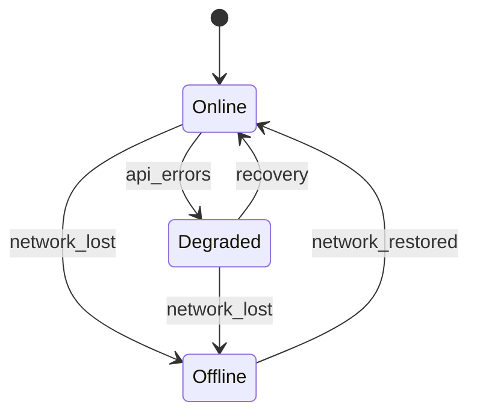

# Operations 01 — Operatsion talablar

**Hujjat:** Cyber Guardian AI  
**Bo‘lim:** Operational Requirements  
**Versiya:** 1.0.0-draft  
**Rol:** QA/DevOps Lead + Security Architect

---

## 12.1 Notification tizimi

### Darajalar

| Daraja | Qachon | UX | Retention |
|--------|--------|-----|-----------|
| `info` | Toza skan, maslahat, sync OK | Jim / in-app | 90 kun |
| `warning` | Shubhali URL, ochiq Wi-Fi, zaif parol | Banner + optional push | 90 kun |
| `critical` | TI hit, ransomware, scam SMS yuqori score | Tizim notification + in-app interrupt | 90 kun |

### Qoidalar

- Matn: `body_key` + i18n parametrlar (xom PII yo‘q).  
- Critical: Androidda alohida channel `security_critical` (yopib bo‘lmaydigan darajada, lekin foydalanuvchi channel ni o‘chira oladi — sozlamada ogohlantirish).  
- Overlay orqali boshqa ilova ustiga yashirin UI — taqiqlangan.  
- Dedup: bir xil subject_hash uchun 15 daqiqada qayta spam yo‘q.

### FR/NFR

FR-091, NFR-050.

---

## 12.2 Offline / Online almashinuvi

| Holat | Android/Windows | Web |
|-------|-----------------|-----|
| Online | Local + cloud boyitish | To‘liq skan |
| Degraded | Local asosiy; cloud retry | Xabar + qisman cache |
| Offline | Cache IOC + on-device modullar | Oxirgi natijalar; yangi skan blok |

Sync navbati: exponential backoff; imzo tekshiruvisiz delta qo‘llanilmaydi.

---

## 12.3 Avtomatik yangilanish

| Artefakt | Mexanizm | Tekshiruv |
|----------|----------|-----------|
| Threat IOC DB | Delta binary/JSON | ed25519 imzo |
| YARA/Sigma paket | Delta | imzo + versiya |
| On-device ML | To‘liq paket (kamroq) | imzo + min app version |
| App binary | Play / MSI/EXE updater | Store / code signing |

**Qoidalar:**

- Client `since_version` yuboradi.  
- Rollback: oldingi versiya saqlanadi (N-1).  
- Zararli/noto‘g‘ri imzo → discard + audit event.

---

## 12.4 Log tizimi (mahalliy-birinchi, PII’siz)

| Qoida | Tavsif |
|-------|--------|
| Mahalliy-birinchi | Qurilmada aylanma log (hajm limitti ~50 MB) |
| PII’siz | SMS matn, parol, email to‘liq, audio yo‘q |
| Format | Structured JSON lines: `ts, level, event, code` |
| Cloud | Faqat opt-in diagnostika meta yoki crash (consent) |
| Foydalanuvchi | Sozlamadan loglarni tozalash |

---

## 12.5 Audit tizimi

| Maydon | Talab |
|--------|-------|
| Kim | `actor_id` |
| Nima | `action` (masalan, `rule.activate`, `user.delete`, `report.export`) |
| Meta | PII’siz JSON |
| Yozuv | Append-only `audit_logs` |
| O‘zgarmaslik | App-level: UPDATE/DELETE taqiqlangan; DB rol ajratilgan |
| Muddat | 365 kun (NFR-042) |

Admin UI faqat o‘qish; eksport ham auditlanadi.
