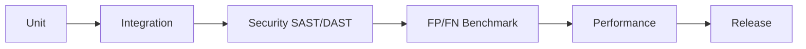
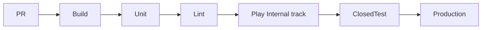
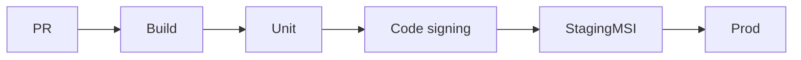
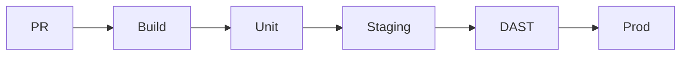

# Operations 02 — Sifat, test va DevOps

**Hujjat:** Cyber Guardian AI  
**Bo‘lim:** QA & DevOps  
**Versiya:** 1.0.0-draft  
**Rol:** QA/DevOps Lead

---

## 13.1 Test strategiyasi

| Qatlam | Nima | Gate |
|--------|------|------|
| Unit | Scoring, normalize URL, consent state | PR |
| Integration | `/v1/scan/*`, sync imzo, auth | PR + staging |
| Security | SAST (har PR), DAST (staging release oldin), SCA | High/Critical blok |
| FP/FN | Gold set URL/SMS/APK meta | Release |
| Performance | NFR-001…005 | Regressiya >20% fail |
| a11y | WCAG smoke | Release |
| Manual | Play permission demo, Windows signing install | Release |

### 13.1.1 Himoya lab qoidalari

- Zararli namunalar faqat izolyatsiyalangan labda.  
- Repoga exploit PoC / raw malware **kiritilmaydi**.  
- Testlar defensive detektorlarni mashq qildiradi; payload tarqatilmaydi.

### 13.1.2 FP/FN benchmark (NFR-072)

| To‘plam | Maqsad |
|---------|--------|
| URL gold | FP < 2%; kritik fishing FN < 5% |
| SMS (uz/ru) | Threshold kalibratsiya; shortcode allowlist |
| APK meta | Soxta bank paketlarini aniqlash (hash/YARA) |

---

## 13.2 CI/CD pipeline (platforma bo‘yicha)

### Android

- Signing: Play App Signing.  
- Restricted permission demo video release checklist da.

### Windows

- Code-signing bosqichisiz prod artefakt yo‘q.  
- Agent + UI alohida versiya yoki monorepo tag (AQ-018).

### Web

- Preview environment har PR (ixtiyoriy).  
- Extension alohida store pipeline (Chrome/Edge).

### Backend

- Container build → staging → migrate → smoke → prod.  
- Migration rollback reja majburiy.

---

## 13.3 Performance chegaralari (qayta)

| Metrika | Chegara |
|---------|---------|
| URL cloud p95 | < 2.0 s |
| Cache hit | < 200 ms |
| On-device SMS model disk | < 15 MB |
| Android CPU qo‘shimcha | < 5% (1 daq oyna) |
| Batareya | < 2%/kun (benchmark) |
| Windows idle CPU | < 3% |
| Windows agent RAM | < 150 MB |
| Web upload | ≤ 25 MB |

---

## 13.4 Observability

- Metrics: scan latency, score distribution, sync fail rate, push fail.  
- Logs: PII’siz structured.  
- Tracing: gateway → scan → scoring.  
- Alert: 5xx spike, sync signature fail, feed stale.

---

## 13.5 Release checklist (qisqa)

1. FR/NFR gate yashil.  
2. FP/FN hisobot.  
3. Privacy/Data safety yangilangan.  
4. Threat feed `license_status=ok`.  
5. Imzo kalitlari rotatsiya holati.  
6. Defensive-only PR checklist belgilangan.
