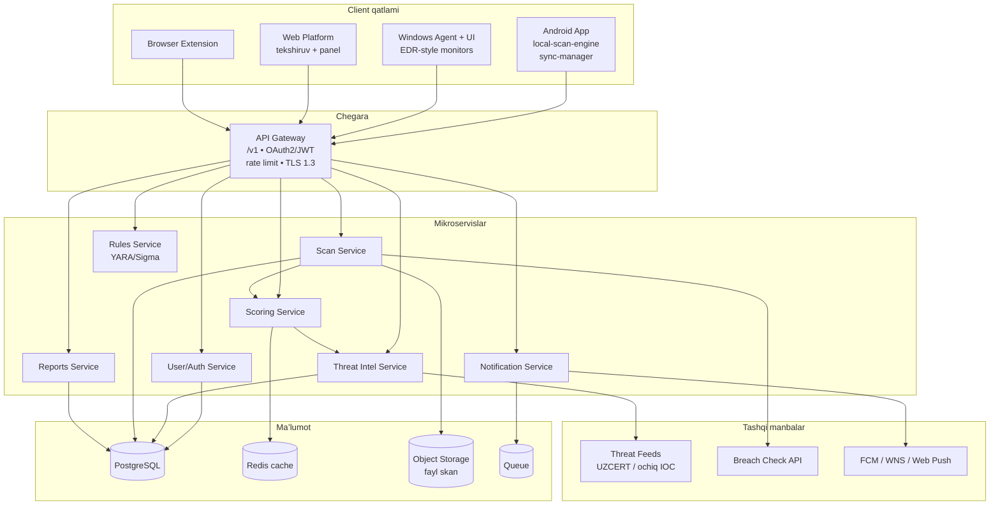
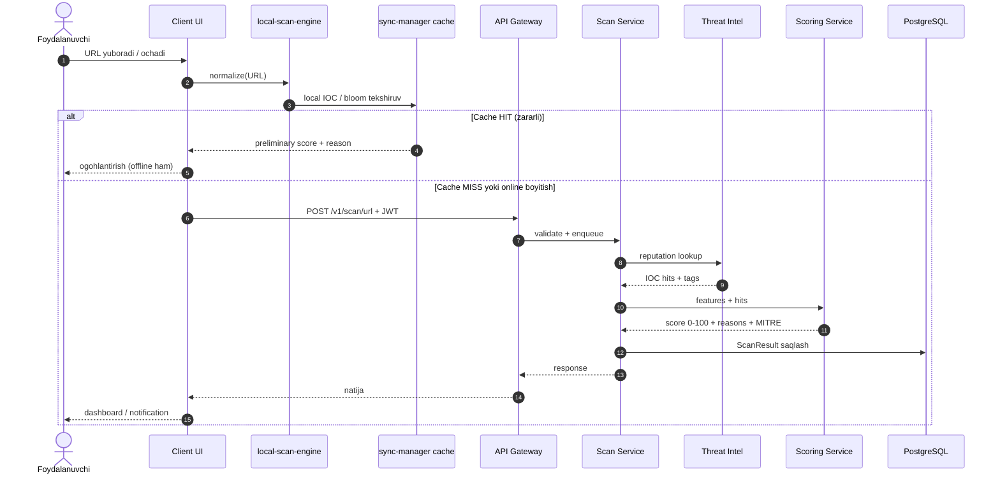
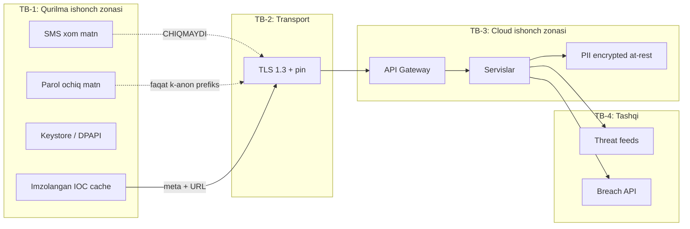

# SDD 01 — Tizim arxitekturasi

**Hujjat:** Cyber Guardian AI Software Design Document  
**Bo‘lim:** 1 — System Architecture  
**Versiya:** 1.0.0-draft  
**Rol:** Principal Security Architect + Full-Stack + AI/ML

---

## 5.1 Yuqori darajadagi arxitektura (HLD)

### 5.1.1 Kontekst

Uch client + browser extension markaziy API Gateway orqali mikroservislarga ulanadi. Threat feedlar Threat Intel Service orqali normalizatsiya qilinadi. Faqat himoya maqsadidagi ma’lumot oqimi.

**Izoh:** Web «to‘liq monitoring» qilmaydi — faqat skan, ta’lim, hisobot, extension boshqaruvi. Windows agent chuqur OS signalini beradi. Android sandbox ichida local-first ishlaydi.

### 5.1.2 Modul bog‘liqliklari

| Modul | Joy | Bog‘liq |
|-------|-----|---------|
| UI | Client | local-scan-engine, sync-manager |
| local-scan-engine | Client | cache IOC, on-device ML, YARA (A/W) |
| sync-manager | Client | Threat Intel sync, imzo tekshiruvi |
| threat-intel-core | BE | feed adapterlar, normalizer |
| scoring-engine | BE | TI, scan features |
| notification-dispatcher | BE | FCM/WNS/WebPush, preferenslar |
| scan-orchestrator | BE | URL/file/QR/breach pipeline |

---

## 5.2 On-device vs Cloud inference

| AI / Detection moduli | On-device | Cloud | Asos |
|----------------------|:--------:|:-----:|------|
| URL engil heuristika + cache | ✅ | ✅ | Tezlik, offline |
| URL chuqur reputation / ML | ⚠️ cache | ✅ | Katta model, yangi IOC |
| Risk Scoring (yakuniy) | ⚠️ engil | ✅ | Yagona model |
| SMS Scam Detection | ✅ majburiy | ❌ xom matn | Maxfiylik, Play |
| Telegram (ulashilgan matn) | ✅ | ✅ URL qismi | Matn local; URL cloud |
| QR decode | ✅ | — | Decode local |
| QR URL score | — | ✅ | Reputation |
| Deepfake Voice | ⚠️ engil | ✅ og‘ir | Og‘ir model serverda; consent |
| Behavior Analysis | ✅ signal | ✅ korrelyatsiya | W signal ko‘p |
| Password health (strength) | ✅ | — | Local |
| Password pwned (k-anon) | — | ✅ range | Maxfiylik |
| Email breach | — | ✅ | Tashqi API |
| File hash | ✅ | — | Local |
| File YARA | ✅ (A/W) | ✅ (Web upload) | Webda native YARA yo‘q |
| Ransomware heuristika | ✅ (W) | ⚠️ telemetry meta | Real-time kerak |
| Wi-Fi analyzer | ✅ | — | OS API |
| DNS blocklist | ✅ | sync | Offline blok |
| MITRE mapping | — | ✅ | Tasnif lug‘ati |

**Qaror qoidasi:**

1. PII yoki xom kontent (SMS, parol, audio) — imkon qadar qurilmada yoki rozilik bilan minimal upload.  
2. Og‘ir model / global IOC — cloud.  
3. Offline muhim bo‘lsa — engil on-device + imzolangan cache.

---

## 5.3 Ma’lumotlar oqimi — shubhali havola → risk score

**Izoh:** Avval local himoya (tez, offline), keyin cloud boyitish. SMS oqimi boshqacha — xom matn GW ga ketmaydi (`compliance/01`).

---

## 5.4 Xavfsizlik chegaralari (Trust Boundaries)

| Ma’lumot | Qurilmadan chiqadimi? | Holat |
|----------|----------------------|-------|
| SMS xom matn | **Yo‘q** | Faqat on-device |
| Parol to‘liq | **Yo‘q** | k-anonymity prefiks hash |
| Audio (deepfake) | Faqat consent + upload | Shifrlangan TLS; retention qisqa |
| URL / domen | Ha | Normalizatsiya; PII query strip |
| Fayl kontenti | Hash afzal; Web upload limitti | Antivirus skan BE |
| Qurilma identifikatori | Ha (pseudonymous device_id) | Hisob bog‘lash |
| Anonim detection meta | Ixtiyoriy consent | Qoida ID, score, til |
| Admin audit | Serverda | O‘zgarmas |

---

## 5.5 Deployment qarashlari (qisqa)

| Muhit | Maqsad |
|-------|--------|
| `dev` | Mahalliy / preview |
| `staging` | DAST, FP test, Play internal |
| `prod` | Production; alohida sirlar |

Batafsil: `sdd/02-uml-er-diagrams.md` (Deployment diagram) va `operations/02-qa-devops.md`.

---

## 5.6 Arxitektura printsiplari

1. **Local-first himoya** — tarmoq yo‘qligida ham asosiy ogohlantirish.  
2. **Minimal ruxsat / minimal ma’lumot**.  
3. **Explainable risk** — score + reasons.  
4. **Imzolangan yangilanishlar** — IOC/qoida/model.  
5. **Platforma haqiqati** — Webni EDR deb yozmaslik.  
6. **Defensive-only** — offensive kod yo‘q.
