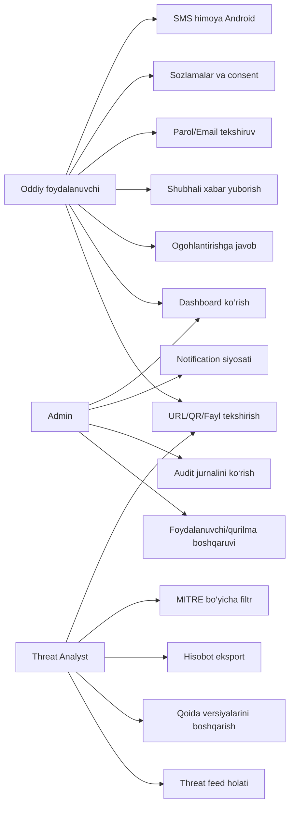
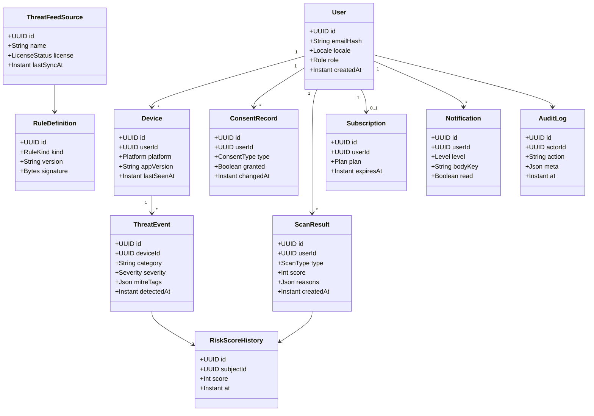
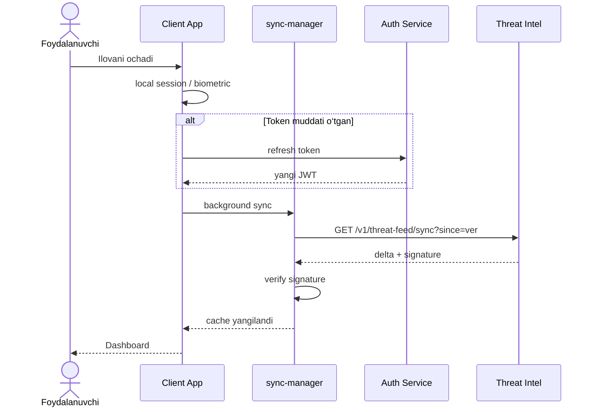
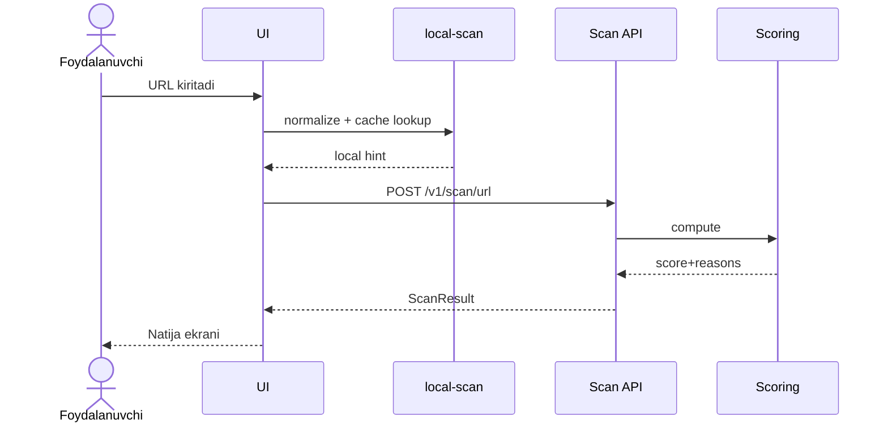
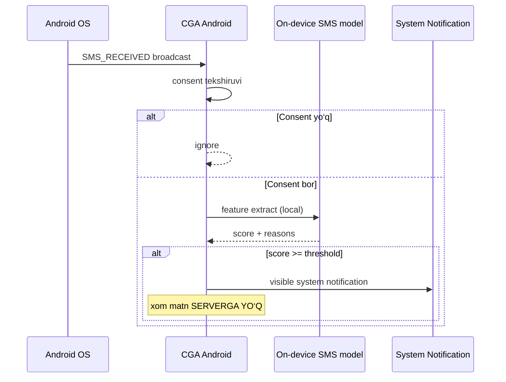
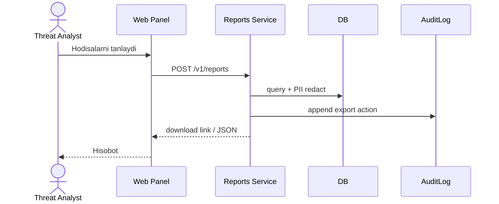
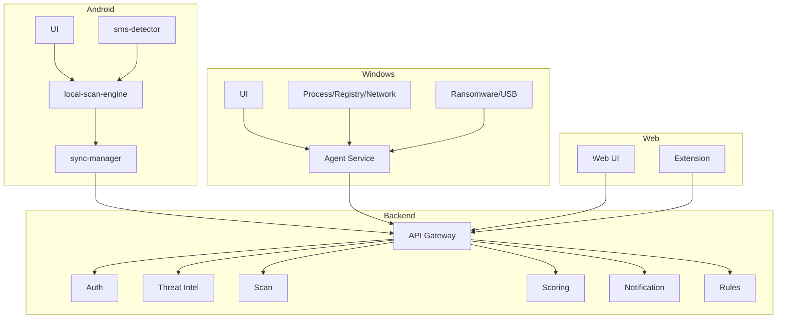
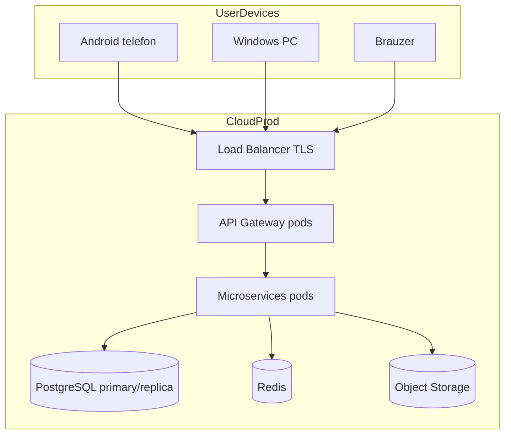
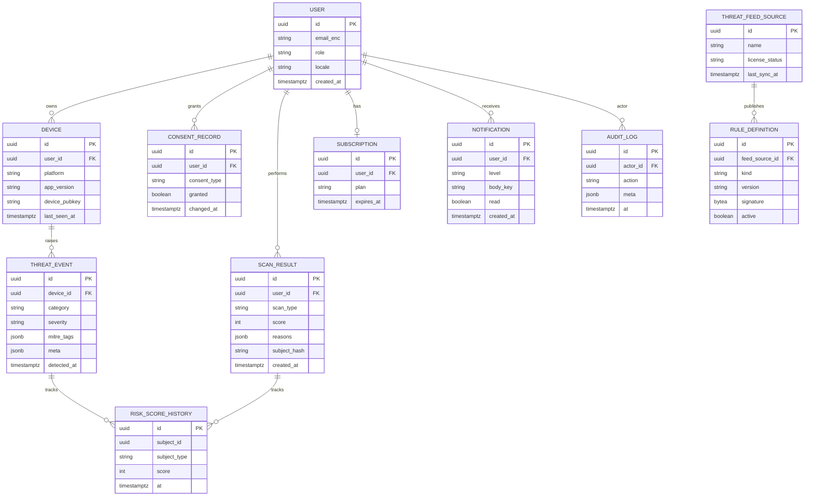

# SDD 02 — UML va ER diagrammalar

**Hujjat:** Cyber Guardian AI SDD  
**Bo‘lim:** 2 — Diagrams  
**Versiya:** 1.0.0-draft  
**Format:** Mermaid + 2–3 jumlali izoh

---

## 2.1 Use Case diagram



**Izoh:** Uch asosiy aktor — oddiy foydalanuvchi (himoya va tekshiruv), admin (boshqaruv/audit), threat-analyst (intel va qoidalar). Barcha use case’lar faqat aniqlash, ogohlantirish, bloklash va hisobotga qaratilgan.

---

## 2.2 Class diagram (core domain)



**Izoh:** Domen modeli himoya artefaktlarini (skan, tahdid hodisasi, qoida, feed) va maxfiylik artefaktlarini (consent, audit) birlashtiradi. PII maydonlar hash/shifrlangan holda saqlanadi (`03-api-and-database.md`).

---

## 2.3 Sequence diagramlar

### 2.3.1 Ilova ochilishi



**Izoh:** Ochilishda avval mahalliy sessiya, keyin imzolangan threat delta. Sync muvaffaqiyatsiz bo‘lsa ham dashboard offline cache bilan ochiladi.

### 2.3.2 URL tekshirish



**Izoh:** Local hint darhol ko‘rsatiladi; yakuniy score clouddan keladi. Natija saqlanadi va notification siyosatiga qarab ogohlantiradi.

### 2.3.3 SMS skan (Android, on-device)



**Izoh:** SMS tahlili faqat qurilmada. Ogohlantirish yashirin overlay emas — foydalanuvchiga ko‘rinadigan tizim bildirishnomasi (suiiste’molchi overlay naqshidan farq).

### 2.3.4 Ransomware aniqlanishi (Windows)

```mermaid
sequenceDiagram
  participant Mon as Ransomware Monitor
  participant FS as File System hooks
  participant Proc as Process Monitor
  participant UI as Windows UI
  participant API as ThreatEvent API

  FS->>Mon: honeypot file modified
  Mon->>Proc: correlating process
  Mon->>Mon: entropy / mass-write heuristics
  Mon->>UI: CRITICAL alert + CTA
  Mon->>API: POST ThreatEvent meta
  Note over Mon,API: Fayl kontenti yuborilmaydi; faqat meta
```

**Izoh:** Honeypot + entropiya/heuristika orqali himoya ogohlantirishi. Maqsad — foydalanuvchini to‘xtatish va yo‘riqnoma berish; hujum texnikasi o‘rgatilmaydi.

### 2.3.5 Hisobot yuborish



**Izoh:** Eksport RBAC va audit ostida. PII redaksiya qilinadi; defensive hisobot formati.

---

## 2.4 Component diagram



**Izoh:** Har platforma o‘zining local komponentlariga ega; umumiy aqllilik backendda. Extension Web bilan bir xil Scan/TI API dan foydalanadi.

---

## 2.5 Deployment diagram



**Izoh:** Clientlar faqat LB/Gateway ga chiqadi. Ichki servislar private tarmoqda; DB va object storage alohida xavfsizlik guruhida.

---

## 2.6 ER diagram



**Izoh:** ER majburiy obyektlarni qamrab oladi: User, Device, ScanResult, ThreatEvent, RiskScoreHistory, RuleDefinition, ThreatFeedSource, Subscription, Notification, AuditLog, ConsentRecord. Indekslar va retention `03-api-and-database.md` da.
