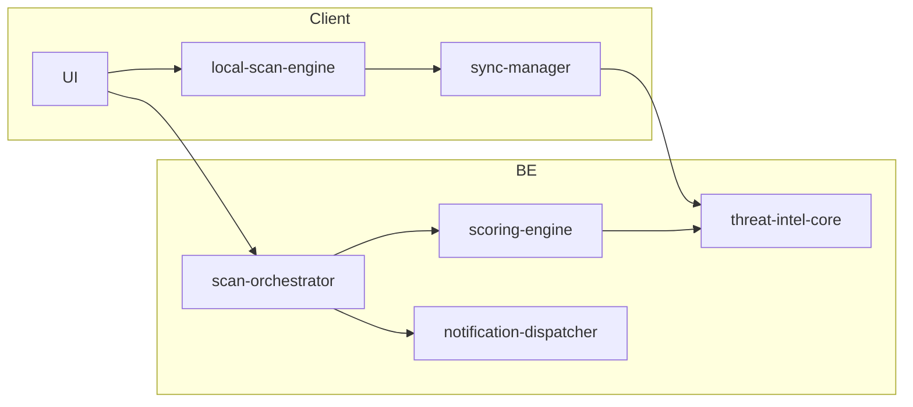

# SDD 03 — API va ma’lumotlar bazasi

**Hujjat:** Cyber Guardian AI SDD  
**Bo‘lim:** 3 — API & Database  
**Versiya:** 1.0.0-draft  
**Rol:** Senior Full-Stack Developer + Privacy Officer

---

## 3.1 Umumiy API qoidalari

| Qoida | Qiymat |
|-------|--------|
| Base | `https://api.cyberguardian.uz/v1` (domen AQ-010) |
| Format | JSON UTF-8 |
| Auth | OAuth2 + Bearer JWT |
| Xatolar | RFC 7807 Problem Details uslubi |
| Rate limit | `X-RateLimit-*` headerlar |
| Idempotency | `Idempotency-Key` (POST skanlar uchun tavsiya) |
| Til | `Accept-Language: uz\|ru\|en` |

### 3.1.1 Umumiy xato javobi

```json
{
  "type": "https://api.cyberguardian.uz/errors/rate-limited",
  "title": "Too Many Requests",
  "status": 429,
  "detail": "Mehmon kvotasi tugadi. Hisob yarating yoki keyinroq urinib ko‘ring.",
  "instance": "/v1/scan/url"
}
```

---

## 3.2 Auth

### `POST /v1/auth/token`
OAuth2 token endpoint (password yoki authorization_code — AQ-011).

**Response 200**
```json
{
  "access_token": "<jwt>",
  "refresh_token": "<opaque>",
  "token_type": "Bearer",
  "expires_in": 900
}
```

### `POST /v1/auth/revoke`
Refresh/access bekor qilish.

---

## 3.3 Scan endpointlari

### `POST /v1/scan/url` — FR-030

**Request**
```json
{
  "url": "https://example.uz/pay",
  "context": {
    "source": "manual|qr|extension|share",
    "client_cache_hit": false
  }
}
```

**Response 200**
```json
{
  "scan_id": "8f3c2a1e-...",
  "url_normalized": "https://example.uz/pay",
  "score": 87,
  "severity": 0.82,
  "verdict": "malicious|suspicious|clean|unknown",
  "reasons": [
    {"code": "TI_DOMAIN_HIT", "message_key": "reason.ti_domain_hit"},
    {"code": "UZ_FAKE_PAYMENT", "message_key": "reason.uz_fake_payment"}
  ],
  "mitre_tags": ["T1566"],
  "recommended_action": "block_and_warn",
  "scanned_at": "2026-07-10T10:00:00Z"
}
```

### `POST /v1/scan/file` — FR-032/033

**Request:** `multipart/form-data`  
- `file` (ixtiyoriy, Web)  
- `sha256` (tavsiya, client hash)  
- `file_name` (sanitized)  
- `run_yara`: boolean  

**Response 200**
```json
{
  "scan_id": "...",
  "sha256": "ab12...",
  "score": 95,
  "verdict": "malicious",
  "ti_hits": [{"source": "internal", "tag": "apk.banker"}],
  "yara_matches": [{"rule": "uz_fake_bank_apk_meta", "namespace": "cga"}],
  "reasons": [{"code": "YARA_MATCH", "message_key": "reason.yara_match"}],
  "mitre_tags": ["T1204"],
  "recommended_action": "do_not_open"
}
```

**Cheklov:** Web upload ≤ 25 MB (NFR-002). Imkon qadar faqat hash yuborish.

### `POST /v1/scan/qr` — FR-031

**Request**
```json
{
  "payload_text": "https://...",
  "image_sha256": "optional-if-uploaded"
}
```
Yoki `multipart` rasm. Server/client avval decode (client afzal), keyin URL pipeline.

**Response:** `scan/url` ga o‘xshash + `qr_type`: `url|text|payment|unknown`.

---

## 3.4 Risk score

### `POST /v1/risk-score`

**Request**
```json
{
  "features": {
    "url_score": 70,
    "ti_hits": 2,
    "behavior_score": 40,
    "local_heuristics": ["short_domain", "punycode"]
  },
  "subject_type": "url|file|message|device",
  "subject_id": "optional"
}
```

**Response**
```json
{
  "score": 78,
  "confidence": 0.77,
  "reasons": [{"code": "COMBINED", "message_key": "reason.combined"}],
  "mitre_tags": ["T1566"],
  "model_version": "score-2026.07.1"
}
```

---

## 3.5 Breach check

### `POST /v1/breach-check` — FR-051

**Request**
```json
{
  "email": "user@example.com"
}
```

**Response**
```json
{
  "found": true,
  "breach_count": 2,
  "breaches": [
    {"name": "ExampleBreach", "year": 2023, "data_classes": ["Email", "Password"]}
  ],
  "recommendations": ["change_password", "enable_2fa", "unique_passwords"]
}
```

**Maxfiylik:** email loglarda to‘liq saqlanmasin (hash/enc); marketing yo‘q.

---

## 3.6 Threat feed sync

### `GET /v1/threat-feed/sync?since_version=20260710.2`

**Response**
```json
{
  "version": "20260710.2",
  "generated_at": "2026-07-10T08:00:00Z",
  "delta_url": "https://cdn.../delta.bin",
  "signature": "base64...",
  "algorithm": "ed25519",
  "item_counts": {"url": 1200, "domain": 800, "sha256": 300}
}
```

Client: yuklab olish → imzo tekshiruvi → qo‘llash. Imzo fail → discard (NFR-011).

---

## 3.7 Reports

### `POST /v1/reports`

**Request**
```json
{
  "from": "2026-06-01T00:00:00Z",
  "to": "2026-07-01T00:00:00Z",
  "types": ["scan", "threat_event"],
  "format": "json|pdf",
  "redact_pii": true
}
```

**Response**
```json
{
  "report_id": "...",
  "status": "ready",
  "download_url": "https://.../reports/...(signed, TTL)"
}
```

---

## 3.8 Qo‘shimcha endpoint guruhlari

| Method | Path | Maqsad |
|--------|------|--------|
| GET | `/v1/me` | Profil (PII minimal) |
| DELETE | `/v1/me` | Erasure so‘rovi |
| GET/POST | `/v1/consents` | Consent CRUD |
| GET | `/v1/devices` | Qurilmalar |
| DELETE | `/v1/devices/{id}` | Qurilmani chiqarish |
| GET | `/v1/notifications` | Bildirishnomalar |
| POST | `/v1/notifications/{id}/read` | O‘qildi |
| POST | `/v1/messages/suspicious` | Shubhali xabar (FR-043) |
| GET | `/v1/admin/audit` | Admin audit (RBAC) |
| GET | `/v1/admin/feeds` | Feed holati (analyst) |

---

## 3.9 Ma’lumotlar bazasi sxemasi (PostgreSQL)

### 3.9.1 Jadvalar

```sql
-- USER
CREATE TABLE users (
  id UUID PRIMARY KEY,
  email_enc BYTEA,              -- AES-256-GCM at-rest
  email_hash CHAR(64) NOT NULL, -- lookup
  phone_enc BYTEA,
  role VARCHAR(32) NOT NULL DEFAULT 'user',
  locale VARCHAR(8) NOT NULL DEFAULT 'uz',
  created_at TIMESTAMPTZ NOT NULL,
  deleted_at TIMESTAMPTZ
);

-- DEVICE
CREATE TABLE devices (
  id UUID PRIMARY KEY,
  user_id UUID NOT NULL REFERENCES users(id),
  platform VARCHAR(16) NOT NULL, -- android|windows|web
  app_version VARCHAR(32),
  device_pubkey TEXT,
  last_seen_at TIMESTAMPTZ,
  created_at TIMESTAMPTZ NOT NULL
);

-- CONSENT_RECORD
CREATE TABLE consent_records (
  id UUID PRIMARY KEY,
  user_id UUID NOT NULL REFERENCES users(id),
  consent_type VARCHAR(64) NOT NULL, -- sms|vpn|audio_upload|analytics_meta
  granted BOOLEAN NOT NULL,
  changed_at TIMESTAMPTZ NOT NULL,
  source VARCHAR(32) NOT NULL -- ui|import
);

-- SCAN_RESULT
CREATE TABLE scan_results (
  id UUID PRIMARY KEY,
  user_id UUID REFERENCES users(id),
  device_id UUID REFERENCES devices(id),
  scan_type VARCHAR(16) NOT NULL, -- url|file|qr|message
  score INT NOT NULL CHECK (score BETWEEN 0 AND 100),
  verdict VARCHAR(16) NOT NULL,
  reasons JSONB NOT NULL,
  subject_hash CHAR(64), -- url/file hash, not raw SMS
  mitre_tags JSONB,
  created_at TIMESTAMPTZ NOT NULL
);

-- THREAT_EVENT
CREATE TABLE threat_events (
  id UUID PRIMARY KEY,
  device_id UUID NOT NULL REFERENCES devices(id),
  category VARCHAR(64) NOT NULL,
  severity VARCHAR(16) NOT NULL, -- info|warning|critical
  mitre_tags JSONB,
  meta JSONB NOT NULL, -- PII'siz
  detected_at TIMESTAMPTZ NOT NULL
);

-- RISK_SCORE_HISTORY
CREATE TABLE risk_score_history (
  id UUID PRIMARY KEY,
  subject_id UUID NOT NULL,
  subject_type VARCHAR(32) NOT NULL,
  score INT NOT NULL,
  at TIMESTAMPTZ NOT NULL
);

-- THREAT_FEED_SOURCE
CREATE TABLE threat_feed_sources (
  id UUID PRIMARY KEY,
  name VARCHAR(128) NOT NULL,
  license_status VARCHAR(32) NOT NULL, -- ok|review|blocked
  endpoint TEXT,
  last_sync_at TIMESTAMPTZ
);

-- RULE_DEFINITION
CREATE TABLE rule_definitions (
  id UUID PRIMARY KEY,
  feed_source_id UUID REFERENCES threat_feed_sources(id),
  kind VARCHAR(16) NOT NULL, -- yara|sigma|ioc|heuristic
  version VARCHAR(32) NOT NULL,
  payload_uri TEXT NOT NULL,
  signature BYTEA NOT NULL,
  active BOOLEAN NOT NULL DEFAULT true
);

-- SUBSCRIPTION
CREATE TABLE subscriptions (
  id UUID PRIMARY KEY,
  user_id UUID NOT NULL REFERENCES users(id),
  plan VARCHAR(32) NOT NULL, -- free|plus
  expires_at TIMESTAMPTZ,
  created_at TIMESTAMPTZ NOT NULL
);

-- NOTIFICATION
CREATE TABLE notifications (
  id UUID PRIMARY KEY,
  user_id UUID NOT NULL REFERENCES users(id),
  level VARCHAR(16) NOT NULL,
  body_key VARCHAR(128) NOT NULL,
  body_params JSONB,
  read BOOLEAN NOT NULL DEFAULT false,
  created_at TIMESTAMPTZ NOT NULL
);

-- AUDIT_LOG (append-only)
CREATE TABLE audit_logs (
  id UUID PRIMARY KEY,
  actor_id UUID REFERENCES users(id),
  action VARCHAR(64) NOT NULL,
  meta JSONB NOT NULL,
  at TIMESTAMPTZ NOT NULL
);
```

### 3.9.2 Indekslar

- `users(email_hash)` UNIQUE  
- `devices(user_id, platform)`  
- `scan_results(user_id, created_at DESC)`  
- `threat_events(device_id, detected_at DESC)`  
- `notifications(user_id, read, created_at DESC)`  
- `audit_logs(at DESC)`  

### 3.9.3 PII shifrlash-at-rest

| Maydon | Talab |
|--------|-------|
| `email_enc`, `phone_enc` | AES-256-GCM + KMS kalit |
| Loglar | email/telefon yozilmasin |
| Object storage fayllar | bucket encryption; TTL |
| Backup | shifrlangan |

### 3.9.4 Retention

| Obyekt | Muddat | Amal |
|--------|--------|------|
| scan_results | 180 kun | delete/anonymize |
| threat_events | 180 kun | delete/anonymize |
| risk_score_history | 180 kun | delete |
| notifications | 90 kun | delete |
| audit_logs | 365 kun | saqlash |
| uploaded files | 7 kun | delete |
| deepfake audio | 24–72 soat | delete (AQ-013) |
| erasure request | 30 kun ichida PII | NFR-041 |

---

## 3.10 Modul arxitekturasi (client ↔ backend)



| Client modul | Vazifa |
|--------------|--------|
| UI | Ekranlar, i18n, a11y |
| local-scan-engine | Normalize, cache, on-device ML/YARA |
| sync-manager | Delta, imzo, navbat |

| Backend servis | Vazifa |
|----------------|--------|
| threat-intel-core | Feed, IOC, litsenziya holati |
| scoring-engine | Risk score + reasons |
| scan-orchestrator | URL/file/QR/breach pipeline |
| notification-dispatcher | Push/email-in-app |
| rules-service | YARA/Sigma paketlar |
| user-auth-service | OAuth2, RBAC, consent |
