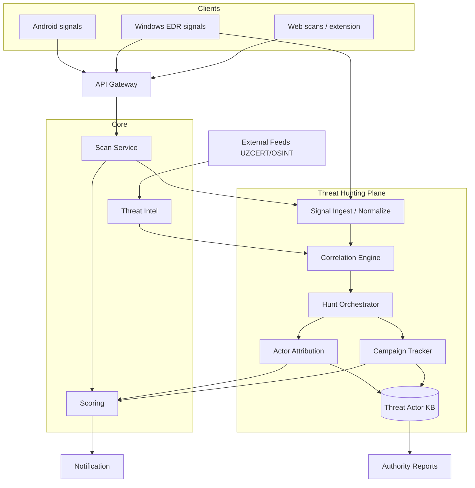
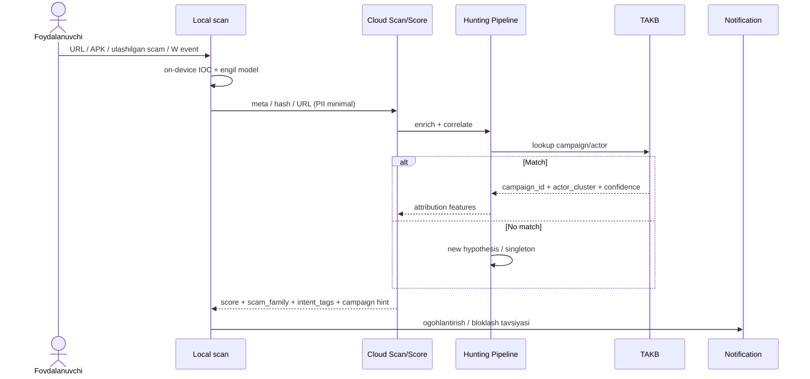
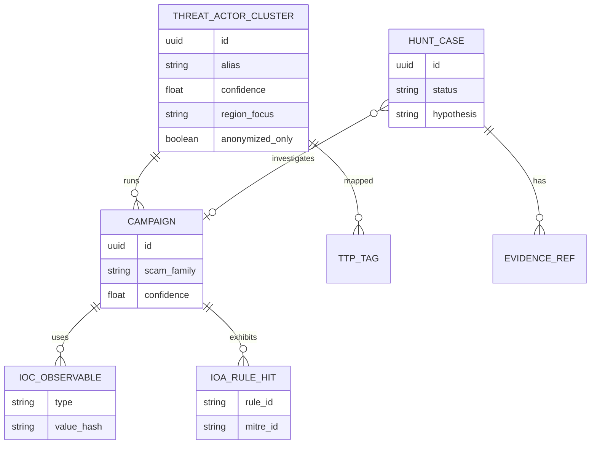

# SDD 06 — Threat Hunting Architecture (Threat Hunter Edition)

**Hujjat:** Cyber Guardian AI SDD  
**Bo‘lim:** 6 — Threat Hunting Pipeline & Actor Knowledge Base  
**Versiya:** 2.0.0-threat-hunter  
**Rol:** Principal Security Architect + Threat Hunter + Full-Stack + AI/ML

---

## 0. Threat Hunting va Actor Detection (majburiy qism)

Arxitektura ikki yangi markaziy komponentni qo‘shadi:

1. **Threat Hunting Pipeline** — signal → korrelyatsiya → hypothesis → alert  
2. **Threat Actor Knowledge Base (TAKB)** — actor/campaign/IOC/TTP ombori  

Faqat mudofaa intellekti. Hech qanday offensive tooling.

---

## 1. Yuqori darajadagi arxitektura (kengaytirilgan)



**Izoh:** Clientlar himoya signalini beradi. Og‘ir korrelyatsiya va attribution cloudda. Windows process ancestry eng boy signal manbai.

---

## 2. Ma’lumotlar oqimi (signal → attribution → ogohlantirish)



**Izoh:** Attribution ishonchi past bo‘lsa foydalanuvchiga «kampaniya» emas, yumshoq ogohlantirish. Analyst TAKB da chuqurroq ko‘radi.

---

## 3. On-device vs Cloud (hunting)

| Komponent | On-device | Cloud | Sabab |
|-----------|:--------:|:-----:|-------|
| Local IOC/IOA match | ✅ | sync | Tezlik, offline |
| Process ancestry capture (W) | ✅ | meta only | Maxfiylik |
| Global correlation | — | ✅ | Ko‘p qurilma |
| Actor attribution ML | — | ✅ | Og‘ir model |
| Campaign graph | — | ✅ | Global |
| APK similarity embedding | ⚠️ hash | ✅ | Hisoblash |
| TAKB UI | — | ✅ Web | RBAC |

---

## 4. Threat Hunting Pipeline — bosqichlar

| Bosqich | Kirish | Chiqish | Egasi |
|---------|--------|---------|-------|
| 1. Collect | Client events, scans | Normalized signal | Ingest |
| 2. Enrich | TI feeds, YARA/Sigma hits | Enriched event | TI + Rules |
| 3. Correlate | Time/IOC/graph | Linked set | Correlation |
| 4. Hypothesize | Linked set | Hunt case | Orchestrator |
| 5. Attribute | Case + TAKB | campaign/actor | Attribution |
| 6. Act | Score + policy | Notify / block / report | Notif + Reports |
| 7. Learn | Analyst feedback | Rule/model update | TI ops |

**Defensive guardrails:** har bosqichda PII strip; offensive action yo‘q; faqat alert/block/report.

---

## 5. Threat Actor Knowledge Base (sxema)



### SQL (qo‘shimcha jadvallar — qisqa)

```sql
CREATE TABLE hunt_cases (
  id UUID PRIMARY KEY,
  hypothesis TEXT NOT NULL,
  status VARCHAR(32) NOT NULL, -- open|validated|false_positive|reported
  campaign_id UUID,
  actor_cluster_id UUID,
  created_by UUID,
  created_at TIMESTAMPTZ NOT NULL,
  meta JSONB NOT NULL -- PII'siz
);

CREATE TABLE ioa_rule_hits (
  id UUID PRIMARY KEY,
  device_id UUID,
  rule_id VARCHAR(64) NOT NULL,
  mitre_id VARCHAR(16),
  detected_at TIMESTAMPTZ NOT NULL,
  meta JSONB NOT NULL
);
```

---

## 6. Windows Threat Hunting (EDR-uslub)

| Signal | Aniqlash maqsadi |
|--------|------------------|
| Process ancestry | Shubhali parent-child zanjiri |
| Network anomaly | Noodatiy tashqi bog‘lanish + TI hit |
| Registry IOA | Himoya qoidalari belgilagan kalitlar |
| Lateral movement **indicators** | Ichki hostlararo shubhali naqsh — **faqat aniqlash** |

Agent faqat monitoring/alert/block policy. Exploit, credential dump qo‘llanmasi, offensive lateral tool — yo‘q.

---

## 7. Android hunting

| Signal | Izoh |
|--------|------|
| APK similarity | Cert/package/fuzzy hash |
| Scam share | Ulashilgan bot/URL → campaign |
| DNS block events | IOA meta (consent) |

Minimal ruxsat saqlanadi; SMS xom matn cloud hunting ga kirmaydi.

---

## 8. Web hunting dashboard

- Agregat trendlar (UZ scam oilalari)  
- Kampaniya kartochkalari (redacted IOC)  
- Actor cluster (analyst)  
- Ta’lim + tezkor skan  

Brauzer OS EDR o‘rnini bosmaydi.

---

## 9. Trust boundary (hunting)

| Ma’lumot | Chiqadimi? |
|----------|------------|
| SMS/parol/xom chat | Yo‘q |
| Anonim event meta (consent) | Ha |
| Hash/URL/bot id | Ha |
| Actor alias (foydalanuvchi) | Faqat yumshoq hint (AQ-022) |
| To‘liq TAKB | Faqat analyst + authority report |

---

## 10. API (hunting)

| Method | Path | Rol |
|--------|------|-----|
| GET | `/v1/hunt/cases` | analyst |
| POST | `/v1/hunt/cases` | analyst |
| GET | `/v1/actors/{id}` | analyst |
| GET | `/v1/campaigns/{id}` | analyst / limited user |
| POST | `/v1/apk/similarity` | auth user |
| POST | `/v1/reports/authority` | admin/analyst |

---

## 11. Modul bog‘liqlik

`local-scan` → `scan-orchestrator` → `correlation-engine` → `campaign-tracker` + `actor-attribution` → `scoring-engine` → `notification-dispatcher` → `takb` → `authority-report`
