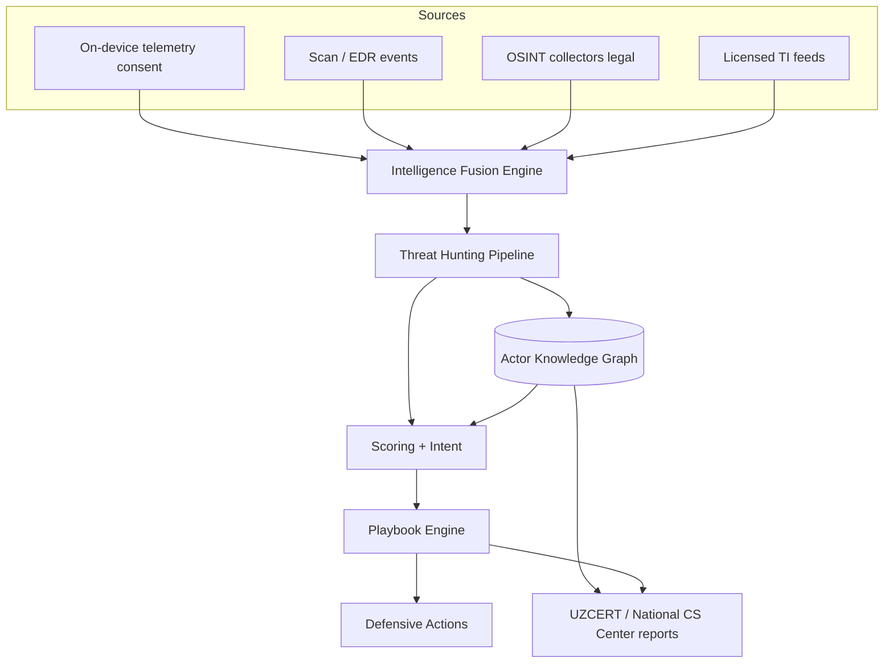
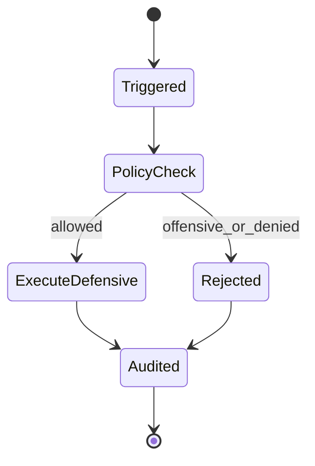

# SDD 07 — Intelligence Fusion, Knowledge Graph & Defensive Playbooks

**Hujjat:** Cyber Guardian AI SDD  
**Bo‘lim:** 7 — Killer Architecture Extensions  
**Versiya:** 3.0.0-killer  
**Rol:** Architect & Red/Blue Lead + Full-Stack Security + APT Hunter  
**Cheklov:** Playbooklar faqat mudofaa choralari.

---

## 0. Threat Hunting & Actor Detection (majburiy)

Killer arxitektura 4 ta qo‘shimcha komponent:

1. **Threat Hunting Pipeline** (real-time + scheduled) — mavjud `sdd/06`  
2. **Actor Knowledge Graph** — Neo4j (yoki ekvivalent)  
3. **Intelligence Fusion Engine** — OSINT + private feeds + telemetry  
4. **Automated Playbook Engine** — defensive response only  

---

## 1. Yuqori darajadagi diagramma



**Izoh:** Fusion barcha manbalarni normalizatsiya qiladi. Graph actor/kampaniya bog‘lanishini saqlaydi. Playbook faqat blok/karantin/xabar/hisobot.

---

## 2. Actor Knowledge Graph

### 2.1 Tugun turlari

| Node | Maydonlar (PII’siz) |
|------|---------------------|
| ActorCluster | alias, confidence, region_focus |
| Campaign | scam_family, first/last_seen |
| Observable | type, value_hash |
| Infrastructure | domain/ip/asn/cert_fp |
| TTP | mitre_id / uz_ttp_id |
| PlaybookRun | action, status, at |

### 2.2 Aloqalar

`Actor-[:RUNS]->Campaign-[:USES]->Observable`  
`Campaign-[:HOSTED_ON]->Infrastructure`  
`Campaign-[:EXHIBITS]->TTP`  
`Actor-[:SIMILAR_TO]->Actor` (fingerprint)

### 2.3 Texnologiya taxmini

- **Neo4j** yoki managed graph (AQ-027).  
- PostgreSQL — operatsion OLTP; graph — correlation/attribution.

---

## 3. Intelligence Fusion Engine

| Bosqich | Tavsif |
|---------|--------|
| Ingest | Manba adapterlari (feed, OSINT, device) |
| Normalize | Bir xil schema: observable, time, confidence, license |
| Dedup | value_hash + time window |
| Score merge | Weighted confidence by source trust |
| Emit | Hunting pipeline + graph upsert |

**On-device telemetry:** faqat consent + anonim meta (FR-209). SMS xom matn — yo‘q.

**OSINT:** ochiq web/Telegram ommaviy kanallar; yopiq tizimga noqonuniy kirish yo‘q. Dark web — faqat qonuniy/litsenziyalangan provayder (AQ-030).

---

## 4. Automated Playbook Engine (defensive-only)

### 4.1 Ruxsat etilgan action lar

| Action ID | Ta’sir |
|-----------|--------|
| `notify_user` | Ogohlantirish |
| `block_ioc_dns` | DNS/IOC blok (siyosat) |
| `quarantine_file` | Fayl karantin (W/A) |
| `open_hunt_case` | Analyst case |
| `enrich_graph` | Graph yangilash |
| `prepare_authority_report` | UZCERT paket navbati |
| `isolate_device_suggest` | Foydalanuvchiga izolyatsiya **tavsiyasi** (majburiy remote wipe default yo‘q — AQ-032) |

### 4.2 Taqiqlangan action lar (CI lint)

- `hack_back`, `exploit_*`, `credential_attack`, `deploy_payload`, `active_intrusion`



### 4.3 Misoli playbook (matn)

**Nom:** `pb_uz_scam_campaign_hit`  
**Trigger:** campaign confidence ≥ 0.8 AND scam_family in money/bot  
**Steps:** notify_user → block_ioc_dns → open_hunt_case → prepare_authority_report  

---

## 5. On-device vs Cloud (Killer)

| Komponent | On-device | Cloud |
|-----------|:--------:|:-----:|
| Yengil anomaly (TFLite/ONNX) | ✅ | — |
| IOC sweep cache | ✅ | sync |
| Process ancestry capture | ✅ W | meta |
| Memory anomaly indicators | ✅ W | meta only |
| Graph Neural Networks | — | ✅ |
| LLM TTP summarization (analyst assist) | — | ✅ PII strip |
| Fusion + Playbooks | — | ✅ |
| OSINT collectors | — | ✅ |

---

## 6. Ma’lumot oqimi (killer)

```text
Signal → Fusion → Hunt (real-time|scheduled) → Knowledge Graph
  → Score/Intent/Attribution → Playbook (defensive) → User notify / Block / CERT
```

---

## 7. API qo‘shimchalari

| Method | Path | Maqsad |
|--------|------|--------|
| GET | `/v1/graph/actors/{id}` | Graph projection (RBAC) |
| POST | `/v1/fusion/ingest` | Ichki manba (service auth) |
| GET | `/v1/playbooks` | Ro‘yxat |
| POST | `/v1/playbooks/{id}/run` | Qo‘lda ishga tushirish (audit) |
| POST | `/v1/ioc/sweep` | On-demand sweep |
| GET | `/v1/infrastructure/{id}` | Suspicious infra card |

---

## 8. Xavfsizlik chegarasi

| Zona | Qoida |
|------|-------|
| Device | Xom PII chiqmaydi |
| Fusion | License + consent gate |
| Graph | No raw identity |
| Playbook | Offensive lint |
| CERT export | Signed, audited, minimized |
