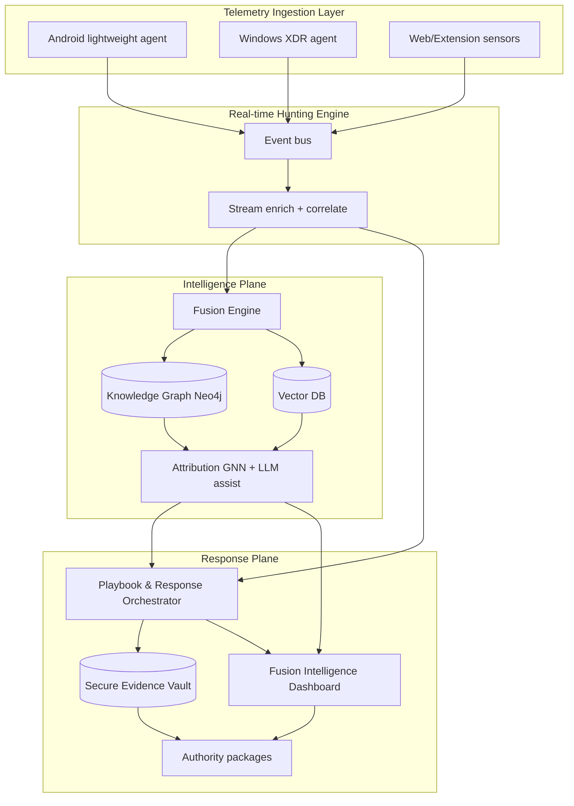
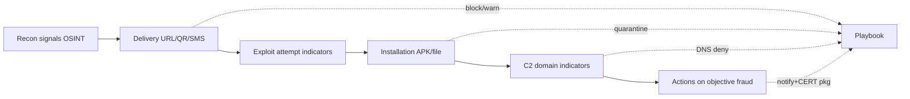

# SDD 08 — Apex Architecture (XDR-grade Defensive Hunting)

**Hujjat:** Cyber Guardian AI SDD  
**Bo‘lim:** 8 — Apex System Architecture  
**Versiya:** 4.0.0-apex  
**Rol:** Hunt Lead + Secure Full-Stack + Forensics Lead  
**Cheklov:** Response orchestrator faqat himoya choralari.

---

## 0. Threat Hunting & Actor Disruption Strategy (majburiy)

Arxitektura kill-chain bo‘ylab **himoya to‘xtatish nuqtalari**ni ta’minlaydi (delivery blok, installation karantin, C2 domen deny). Attacker infratuzilmasiga hujum qilish komponenti yo‘q; organlarga intelligence paketi bor.

---

## 1. Asosiy komponentlar



| Komponent | Vazifa |
|-----------|--------|
| Telemetry Ingestion | On-device lightweight agents; minimal PII |
| Real-time Hunting Engine | Stream processing |
| Intelligence Knowledge Graph | Neo4j + **Vector DB** (embeddings) |
| Attribution & Correlation | GNN + LLM (analyst assist, PII strip) |
| Playbook & Response Orchestrator | Defensive only |
| Secure Evidence Vault | Forensics, chain-of-custody |
| Fusion Intelligence Dashboard | SOC + milliy rol |

---

## 2. On-device / Edge / Cloud jadvali (majburiy)

| Modul / qobiliyat | On-device | Edge* | Cloud |
|-------------------|:--------:|:-----:|:-----:|
| IOC sweep / engil anomaly | ✅ | ⚠️ | sync |
| SMS scam model | ✅ | — | ❌ xom matn |
| URL cache reputation | ✅ | ⚠️ | ✅ |
| Process tree / memory indicators | ✅ W | — | meta |
| Rootkit/injection **detection** IOA | ✅ W | — | correlate |
| Stream correlation | — | ⚠️ | ✅ |
| Graph + Vector search | — | — | ✅ |
| GNN attribution | — | — | ✅ |
| LLM TTP summary | — | — | ✅ |
| Predictive forecasting | — | — | ✅ |
| Playbooks | local actions | — | orchestrate |
| Evidence Vault | — | — | ✅ |
| National dashboard | — | — | ✅ |

\*Edge = ixtiyoriy regional PoP (AQ-036); MVP da bo‘sh bo‘lishi mumkin.

---

## 3. Kill-chain defensive control map



**Izoh:** Nuqtali chiziqlar — himoya response. Exploitation/C2 **qanday qilinishi** tavsiflanmaydi; faqat indikator va blok.

---

## 4. Secure Evidence Vault

| Xususiyat | Talab |
|-----------|-------|
| Yozish | Append-only |
| Shifrlash | AES-256 at-rest; TLS 1.3 |
| Kalit | KMS; per-tenant/org |
| Meta | case_id, hash, collected_at, actor_id, consent_ref |
| Raw memory | Default OFF; explicit forensics role + TTL |
| Export | Signed package → authority / IR |

---

## 5. Zero-trust backend (qisqa)

- mTLS service-to-service (AQ-012)  
- Least privilege RBAC (user / analyst / forensics / national)  
- No standing offensive tool permissions  
- Secrets in vault; hunting keys rotated  

---

## 6. Dashboard qatlamlari

| Rol | Ko‘rinish |
|-----|-----------|
| Oddiy foydalanuvchi | Himoya holati, yumshoq campaign hint |
| SOC analyst | Graph, cases, playbooks |
| Forensics | Evidence Vault |
| National (V4+) | Early-warning agregat (shartnoma) |

---

## 7. Ma’lumot oqimi (Apex)

```text
Agent telemetry → Bus → Real-time Hunt → Fusion
  → Graph + Vector → Attribution (GNN/LLM assist)
  → Score/Intent/Forecast → Defensive Playbook
  → Evidence Vault + User notify + Authority package
```

---

## 8. API (qo‘shimcha)

| Path | Maqsad |
|------|--------|
| `POST /v1/telemetry/events` | Agent ingest (mTLS) |
| `GET /v1/graph/path` | Relationship explain |
| `POST /v1/predict/campaign` | Forecast |
| `POST /v1/evidence` | Vault write |
| `GET /v1/evidence/{id}` | RBAC read |
| `POST /v1/authority/takedown-intel` | FR-407 paket |
| `GET /v1/national/warnings` | V4+ |
