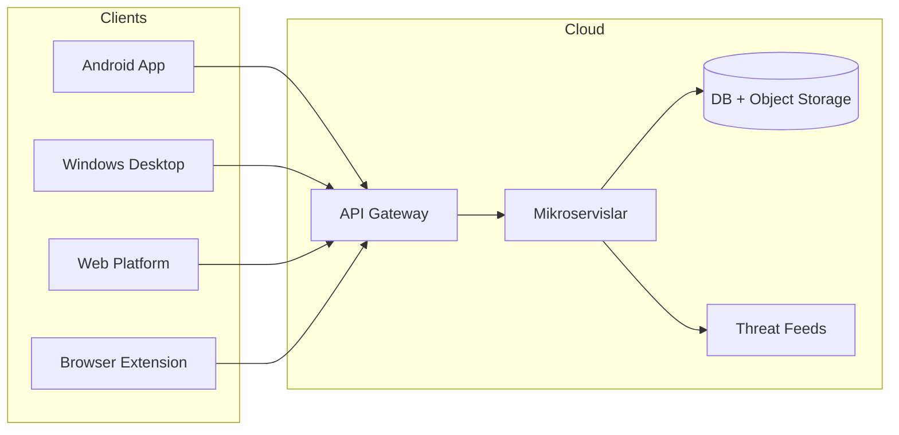

# SRS 02 — Umumiy tavsif (Overall Description)

**Hujjat:** Cyber Guardian AI SRS  
**Bo‘lim:** 2 — Overall Description  
**Versiya:** 1.0.0-draft  
**Rol:** Product + Security Architect + Mobile/Windows/Web leads

---

## 2.1 Mahsulot istiqboli (Product perspective)

Cyber Guardian AI — uchta client mahsulot + bitta markaziy backend ekotizimi.

### 2.1.1 Mahsulot portfeli

| Mahsulot | Asosiy maqsad | Foydalanuvchi profili | Texnik xususiyat |
|----------|---------------|----------------------|------------------|
| **Android ilova** | Kundalik himoya — SMS/Telegram/QR/qo‘ng‘iroq darajasida real-vaqt ogohlantirish | Oddiy foydalanuvchi | OS sandbox; minimal ruxsat |
| **Windows Desktop** | Chuqur tizim himoyasi — EDR-uslubidagi monitoring | Uy + kichik biznes | Yuqori imtiyoz; fayl/registry/jarayon |
| **Web Platforma** | Ta’lim + tezkor tekshiruv + boshqaruv paneli | Har qanday qurilma; qisman mehmon rejim | Brauzer cheklovi — monitoring emas |

### 2.1.2 Web Platforma aniqligi (kritik)

Web Platforma **to‘liq monitoring qila olmaydi** — brauzer OS ga kira olmaydi. Loyihalash:

- URL / parol / email tekshiruvchi
- Hisobot va ta’lim markazi
- Brauzer kengaytmasi boshqaruvchisi
- (Ixtiyoriy) admin/SOC dashboard

Aks holda bajarib bo‘lmaydigan talab paydo bo‘ladi.

### 2.1.3 Tizim interfeyslari (yuqori daraja)

| Interfeys | Tomonlar | Protokol |
|-----------|----------|----------|
| Client ↔ API Gateway | A/W/Web/Ext ↔ BE | HTTPS REST `/v1`, JWT |
| Gateway ↔ Mikroservislar | Ichki | mTLS yoki service mesh (AQ-012) |
| Threat Intel ↔ Tashqi feed | BE ↔ UZCERT/ochiq IOC | HTTPS + ToS |
| Notification | BE ↔ FCM / Windows Toast / Web Push | Vendor API |
| Auth | Client ↔ Auth Service | OAuth2 + JWT |

---

## 2.2 Mahsulot funksiyalari (qisqa ro‘yxat)

Batafsil matritsa: `03-feature-platform-matrix.md`. Qisqa guruhlar:

1. **Tekshiruv:** URL, fayl, QR, email breach, password health  
2. **Aniqlash:** SMS/Telegram scam, behavior, ransomware (W), USB (W)  
3. **Monitoring:** process/registry/network (W), DNS (A/W/Ext), browser protection  
4. **Intel:** threat feed sync, YARA/Sigma, MITRE mapping  
5. **UX:** dashboard, notification, hisobot, ko‘p tillilik, accessibility  
6. **Maxfiylik:** consent, local-first SMS, k-anonymity password check  

---

## 2.3 Foydalanuvchi xususiyatlari

| Persona | Tavsif | Asosiy ehtiyoj | Platforma |
|---------|--------|----------------|-----------|
| **Oddiy foydalanuvchi** | Texnik bilim past; telefon asosiy | Oddiy ogohlantirish, aniq harakat | A, Web (mehmon) |
| **Uy / kichik biznes** | Windows PC ishlatadi | Fayl/USB/ransomware himoya | W, Web |
| **Admin** | Oilaviy yoki kichik jamoa boshqaruvi | Qurilmalar, sozlamalar, audit | Web + W |
| **Threat Analyst** | SOC / TI operatori | Feed, qoidalar, MITRE, hisobot | Web (analyst panel) |

---

## 2.4 Cheklovlar (Constraints)

### 2.4.1 Normativ va huquqiy

| ID | Cheklov |
|----|---------|
| C-01 | O‘zR shaxsga doir ma’lumotlar qonuniga muvofiqlik |
| C-02 | Google Play Restricted Permissions (SMS, Accessibility) |
| C-03 | Deepfake/audio — faqat aniq rozilik + foydalanuvchi yuklagan fayl |
| C-04 | Tashqi threat feed ToS ga rioya |
| C-05 | Faqat defensive funksiyalar |

### 2.4.2 Texnik

| ID | Cheklov |
|----|---------|
| C-10 | Android: SMS xom matn serverga yuborilmaydi |
| C-11 | Android: yashirin overlay ishlatilmaydi |
| C-12 | Web: OS monitoring yo‘q |
| C-13 | Telegram: shaxsiy chat o‘qilmaydi; faqat forward/bot/foydalanuvchi ulashgan kontent |
| C-14 | Parol: serverga ochiq matn yuborilmaydi (k-anonymity) |
| C-15 | Transport: TLS 1.3; at-rest: AES-256 (PII) |
| C-16 | Offline: A/W to‘liq cache; Web — oxirgi natijalar |

### 2.4.3 Operatsion

| ID | Cheklov |
|----|---------|
| C-20 | Avtomatik yangilanish: delta + imzo tekshiruvi |
| C-21 | Log: mahalliy-birinchi, PII’siz |
| C-22 | Audit: admin harakatlari uchun o‘zgarmas jurnal |

---

## 2.5 Taxminlar va qaramliklar (qisqa)

To‘liq ro‘yxat: `../assumptions-and-open-questions.md`.

| ID | Taxmin |
|----|--------|
| A-01 | MVP uchun OAuth2 provider (self-hosted yoki IdP) tanlanadi |
| A-02 | UZCERT feed ochiq API yoki qo‘lda import bilan ishlaydi |
| A-03 | Breach-check uchun Have I Been Pwned yoki ekvivalent ToS ga mos |
| A-04 | Windows agent code-signing sertifikati mavjud bo‘ladi |
| A-05 | Android target SDK Play siyosatiga mos (joriy majburiy daraja) |

---

## 2.6 Talablar taqsimoti (bo‘limlarga)

| Bo‘lim | Mazmun |
|--------|--------|
| SRS 03 | Funksiya × platforma matritsasi |
| SRS 04 | FR-xxx batafsil |
| SRS 05 | NFR-xxx |
| SDD 01–05 | Dizayn |
| Compliance | Maxfiylik va Play |
| Operations | Ops, QA, roadmap |

---

## 2.7 Umumiy (cross-platform) funksiyalar

Barcha 3 platformada bir xil mantiq:

- Security Dashboard  
- Notification tizimi  
- Log / Audit (rolga qarab)  
- Ko‘p tillilik: o‘zbek, rus, ingliz  
- Accessibility (WCAG 2.1 AA)  

**Offline rejim:**

| Platforma | Offline imkoniyat |
|-----------|-------------------|
| Android | Cache qilingan threat DB + on-device SMS/URL heuristika |
| Windows | Cache + local YARA/Sigma subset + monitoring |
| Web | Faqat oxirgi saqlangan natijalarni ko‘rish; yangi skan online talab qiladi |

---

## 2.8 Muvaffaqiyat mezonlari (biznes)

| Metrika | Maqsad (MVP dan keyin o‘lchash) |
|---------|----------------------------------|
| Ogohlantirishdan oldin bloklangan fishing urinishlari | Hisobotda kuzatiladi |
| FP darajasi (URL) | Benchmark to‘plamida < 2% (NFR) |
| Onboarding yakunlash | Ruxsat tushuntirilgan holda |
| Play Store rad etilishi | Restricted permission declaration + demo video tayyor |
| Foydalanuvchi tushunishi | Ogohlantirishda aniq CTA, dark pattern yo‘q |
