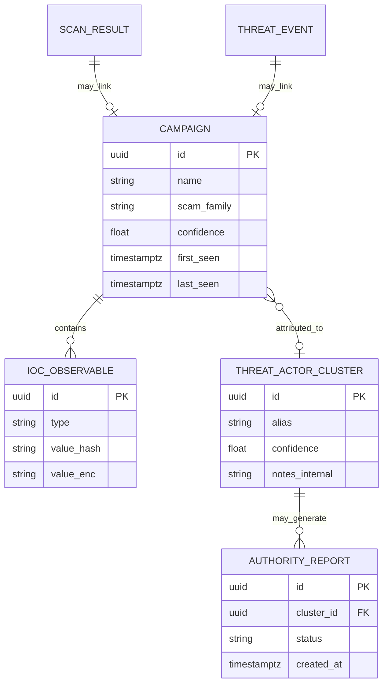
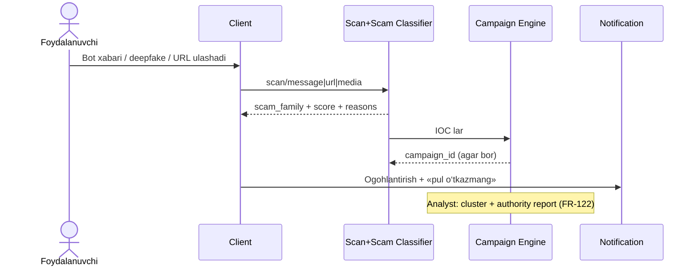

# SRS/SDD — Universal Scam Coverage + Hujumchi/Kampaniya aniqlash (himoya)

**Hujjat:** Cyber Guardian AI  
**Bo‘lim:** Scam Universe & Defensive Attribution  
**Versiya:** 1.1.0-draft  
**Rol:** SOC/TI Lead + AI/ML + Privacy Officer  
**Printsip:** Faqat aniqlash, ogohlantirish, bloklash va rasmiy organlarga **himoya hisoboti**. Hujumga javoban hujum (hack-back), ruxsatsiz kuzatuv yoki exploit — **taqiqlangan**.

---

## 1. Foydalanuvchi maqsadi (talabning mohiyati)

Tizim quyidagilarni **bilib olishi** (aniqlashi) kerak:

| Guruh | Misollar | Natija foydalanuvchiga |
|-------|----------|------------------------|
| Pul taklif qiluvchi scam | «Ish», lotoreya, investitsiya, kripto «x2», soxta grant | Ogohlantirish + bloklash tavsiyasi |
| Bot / soxta akkaunt | Telegram/bot orqali avtomatik pul taklifi | Bot/scam ehtimoli + «yozmang/o‘tkazmang» |
| Deepfake | Ovoz (qo‘ng‘iroq), yuz/video (soxta «qo‘llab-quvvatlash» / tanish) | Sintetik media ehtimoli + SE ogohlantirishi |
| Fishing / soxta sayt | Bank, my.gov, to‘lov, favqulodda ogohlantirish | URL blok / banner |
| QR / SMS firibgarlik | To‘lov QR, kod so‘rash | On-device / skan ogohlantirishi |
| Zararli APK | Soxta bank ilovasi | Fayl reputatsiya |

Va **kerak bo‘lsa** — bir xil infratuzilma/kampaniya orqali ishlayotgan **kiber-firibgarlik tarmog‘ini** (hujumchi guruhini) himoya maqsadida **aniqlash va bog‘lash**:

- Bir xil domen/IP/APK sertifikat/telefon/bot username klasteri  
- Kampaniya ID va «Threat Actor» (taxallus / cluster)  
- Analyst va (rozilik + qonuniy kanal bilan) UZCERT / huquq-tartibot uchun **himoya paketi**

> Bu «hujumchini topib o‘zimiz hujum qilish» emas. Bu — **IOC korrelyatsiyasi + kampaniya klasterlash + rasmiy xabar**.

---

## 2. Scam taksonomiyasi (to‘liq qamrov — aniqlash uchun)

Har bir toifa `scam_family` kodi bilan Risk Scoring va TI ga bog‘lanadi.

| Kod | Oila | Kirish kanallari | Asosiy signal |
|-----|------|------------------|---------------|
| `SCAM_JOB` | Soxta ish / «kuniga $» | Telegram, SMS, web | Pul kafolati + oldindan to‘lov |
| `SCAM_LOTTO` | Lotoreya / yutuq | SMS, Telegram, email | «Yutdingiz» + komissiya |
| `SCAM_INVEST` | Investitsiya / Forex / kripto | Bot, sayt, QR | Kafolatlangan foiz |
| `SCAM_ROMANCE` | Romantik firibgarlik | Messenger (ulashilgan) | Pul so‘rash + shoshilinchlik |
| `SCAM_SUPPORT` | Soxta qo‘llab-quvvatlash | Qo‘ng‘iroq, deepfake, SMS | Kod/karta so‘rash |
| `SCAM_GOV` | Davlat/soliq/politsiya niqobi | URL, SMS, deepfake | Tahdid + to‘lov |
| `SCAM_PAYMENT` | Soxta to‘lov / fishing | URL, QR, APK | Brend spoof |
| `SCAM_EMERGENCY` | Favqulodda ogohlantirish | URL, SMS | Urgency + soxta portal |
| `SCAM_BOT_MONEY` | Bot orqali avtomatik pul taklifi | Telegram bot, web widget | Bot belgilari + money script |
| `SCAM_DEEPFAKE` | Sintetik ovoz/yuz/video | Yuklangan media (consent) | Deepfake score + SE matn |
| `SCAM_APK_BANK` | Soxta bank APK | Fayl/havola | Hash/YARA/meta |
| `SCAM_OTHER` | Boshqa / noaniq | Har qanday | Umumiy klassifikator |

**Qoida:** Yangi scam varianti chiqsa — avval `SCAM_OTHER` + analyst teg, keyin oilaga ko‘chiriladi. «Hammasi» = shu taksonomiya + doimiy feed yangilanishi (100% kafolat emas — NFR da coverage maqsadi).

---

## 3. Funksional talablar (yangi)

### FR-044 — Universal scam klassifikatori
- **P0** (asosiy oilalar V1 URL/matn; to‘liq V2) | [A][W][Web][BE]
- Har bir skan/ulashilgan xabar `scam_family[]` + score + reasons qaytaradi.
- **Qabul:** kamida jadvaldagi oilalar uchun qoida yoki model yo‘li bor; noma’lum → `SCAM_OTHER` + «ehtiyot».

### FR-045 — Pul taklif qiluvchi bot / skript aniqlash
- **P1** | [A][W][Web][BE]
- Ulashilgan bot username, bot xabar naqshi, «pul yuboring / oldindan to‘lov / kafolat» skripti.
- **Qabul:** shaxsiy chat o‘qilmaydi; faqat foydalanuvchi ulagan kontent yoki ommaviy bot ID TI da.
- **Chiqish:** `SCAM_BOT_MONEY` + «Bu botga pul o‘tkazmang» CTA.

### FR-046 — Deepfake yuz / video (consent)
- **P2** | [A][W][Web][BE]
- Foydalanuvchi rozilik bilan yuklagan rasm/video uchun sintetik media ehtimoli.
- **Qabul:** jonli kamera fon yozuvi yo‘q; consent majburiy; natija + SE ogohlantirishi.

### FR-047 — Cross-channel scam korrelyatsiya
- **P1** | [BE]
- Bir xil URL/telefon/bot bir nechta kanaldan (SMS meta, Telegram share, QR, web) kelsa — yagona kampaniya balli.
- **Qabul:** foydalanuvchi dashboardida «shu firibgarlik tarmog‘i boshqa joyda ham uchragan» (PII’siz).

### FR-120 — Kampaniya klasterlash (defensive attribution)
- **P1** | [BE][Web-analyst]
- IOC lar (domen, IP, URL path, APK cert hash, bot username, telefon hash, YARA oila) bo‘yicha `Campaign` obyekti.
- **Qabul:** yangi skan mavjud kampaniyaga bog‘lanishi mumkin; explainability: qaysi IOC lar birlashgan.

### FR-121 — Threat Actor / cluster profili
- **P2** | [BE][Web-analyst]
- Bir yoki bir nechta kampaniyani `ThreatActorCluster` (taxallus, ishonch darajasi, birinchi/oxirgi ko‘rinish) ga bog‘lash.
- **Qabul:** haqiqiy shaxsni doxing qilish yo‘q; faqat infratuzilma/cluster; ishonch past bo‘lsa «taxminiy».

### FR-122 — Rasmiy organlarga himoya hisoboti
- **P1** | [Web][BE]
- Analyst/admin (yoki foydalanuvchi roziligi bilan) UZCERT/huquq-tartibot uchun paket: IOC lar, kampaniya ID, vaqt oralig‘i, scam_family — **exploit yo‘q**.
- **Qabul:** audit; PII minimal; hack-back tugmasi yo‘q.

### FR-123 — Foydalanuvchiga «kim?» tushuntirishi
- **P1** | [A][W][Web]
- Oddiy til: «Bu xabar ma’lum firibgarlik kampaniyasiga o‘xshaydi (ID: …). Bir xil havolalar boshqa foydalanuvchilarda ham bloklangan.»
- **Qabul:** qo‘rqitish yo‘q; aniq CTA; dark pattern yo‘q.

---

## 4. Ma’lumotlar modeli (qo‘shimcha)



**PII:** telefon/email — hash yoki enc; foydalanuvchi chatlari saqlanmaydi.

---

## 5. API qo‘shimchalari

### `POST /v1/scan/message` (ulashilgan matn/bot)
```json
{
  "text": "Kuniga 500$ ish... botga yozing @example_bot",
  "source": "telegram_share|paste|sms_meta",
  "entities": {"bot_username": "example_bot", "urls": []}
}
```
**Response:** score, `scam_family`, reasons, ixtiyoriy `campaign_id`.

### `GET /v1/campaigns/{id}`
Analyst/RBAC: kampaniya IOC lari, oila, ishonch (PII redacted).

### `POST /v1/reports/authority`
FR-122 paketi yaratish (audit + signed download).

### `POST /v1/scan/media` (deepfake audio/image/video)
Consent flag majburiy; retention qisqa.

---

## 6. AI modullari (yangi / kengaytirilgan)

### Universal Scam Classifier
- **Kirish ma’lumoti:** Ulashilgan matn, URL, bot ID, QR payload, (consent) media meta.
- **Feature extraction:** Money-offer lug‘ati (uz/ru/en), urgency, to‘lov so‘rovi, bot/CTA naqshlari, URL features, deepfake score.
- **Model/heuristika turi:** Multi-label klassifikator + qoida floor (`SCAM_*`).
- **Chiqish:** `scam_family[]` + score + reasons.
- **False positive kamaytirish:** Rasmiy bank/ish elonlari allowlist; past confidence → ehtiyot.
- **Ma’lumot manbalari:** Foydalanuvchi hisobotlari, UZCERT, annotatsiya (PII’siz).
- **On-device / Cloud:** Engil on-device; to‘liq cloud.
- **Yangilanish:** Lug‘at haftalik; model 2 haftada.

### Money-Offer Bot Detector
- **Kirish:** Bot username, ulashilgan bot xabari, TI bot blocklist.
- **Feature extraction:** Bot pattern, skript takrorlanishi, «oldindan to‘lov», wallet/karta so‘rovi.
- **Model/heuristika:** TI list + matn klassifikator.
- **Chiqish:** `SCAM_BOT_MONEY` + campaign link.
- **FP:** Rasmiy botlar allowlist.
- **Manba:** Ichki hisobot + ochiq scam bot ro‘yxatlari (ToS).
- **On-device/Cloud:** Username local cache; matn — ulashganda.
- **Yangilanish:** Bot IOC kunlik.

### Deepfake Face / Video Detection
- **Kirish:** Consent bilan yuklangan rasm/video.
- **Feature extraction:** Yuz artefaktlari, temporal inconsistency (video), ixtiyoriy transcript SE.
- **Model:** Cloud vision model.
- **Chiqish:** synthetic_score + `SCAM_DEEPFAKE` + SE hit.
- **FP:** Past sifat → «aniqlanmadi»; ayblov emas.
- **Manba:** Ochiq deepfake korpus (litsenziya).
- **On-device/Cloud:** Asosan cloud.
- **Yangilanish:** Model oylik.

### Campaign & Actor Attribution Engine (defensive)
- **Kirish:** IOC lar, scam_family, vaqt, geo-proxy (agar mavjud, noaniq).
- **Feature extraction:** Graf: observable ↔ scan; community detection / qoida asosida klaster.
- **Model:** Heuristik klasterlash + analyst tasdiq; avtomatik «jinoyatchi ismi» yo‘q.
- **Chiqish:** `campaign_id`, `actor_cluster_id` (taxminiy), confidence, linked IOC count.
- **FP:** Past confidence da bog‘lamaslik; inson tasdiq (analyst).
- **Manba:** Ichki skanlar, feed, hisobotlar.
- **On-device/Cloud:** Faqat cloud (BE).
- **Yangilanish:** Real-time ingest; klaster qayta hisoblash soatlik/kunlik.

---

## 7. Foydalanuvchi oqimi (qisqa)



---

## 8. Chegaralar (majburiy)

| Ruxsat etiladi | Taqiqlanadi |
|----------------|-------------|
| Scam/bot/deepfake aniqlash | Shaxsiy chatlarni o‘qish |
| Kampaniya/IOC klasterlash | Hack-back / qarshi hujum |
| Rasmiy organlarga himoya hisoboti | Doxing, shaxsiy ma’lumotni ommaga chiqarish |
| Foydalanuvchini ogohlantirish | Exploit/zararli kod tarqatish |
| Consent media tahlili | Yashirin yozib olish |

---

## 9. Roadmap bog‘lanishi

| Versiya | Nima |
|---------|------|
| V1 | `SCAM_PAYMENT`, `SCAM_GOV`, `SCAM_EMERGENCY` (URL/QR); asosiy klassifikator skeleti |
| V2 | `SCAM_JOB/LOTTO/INVEST/BOT_MONEY`, SMS, Telegram share, FR-047/120/122/123 |
| V3 | Deepfake voice+face/video (FR-042/046), FR-121 actor cluster, B2B TI |

---

## 10. Ochiq savollar

| ID | Savol |
|----|-------|
| AQ-021 | UZCERT ga avtomatik hisobot API bormi yoki qo‘lda yuklash? |
| AQ-022 | Actor cluster taxalluslarini foydalanuvchiga ko‘rsatish kerakmi yoki faqat analystga? |
| AQ-023 | Deepfake video hajm limitti? |
| AQ-024 | Telegram Bot API orqali faqat foydalanuvchi botga yuborganini tekshirish (rasmiy botimiz) — mahsulot qarori? |
